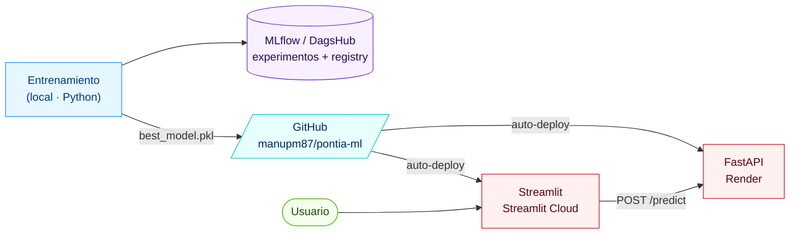
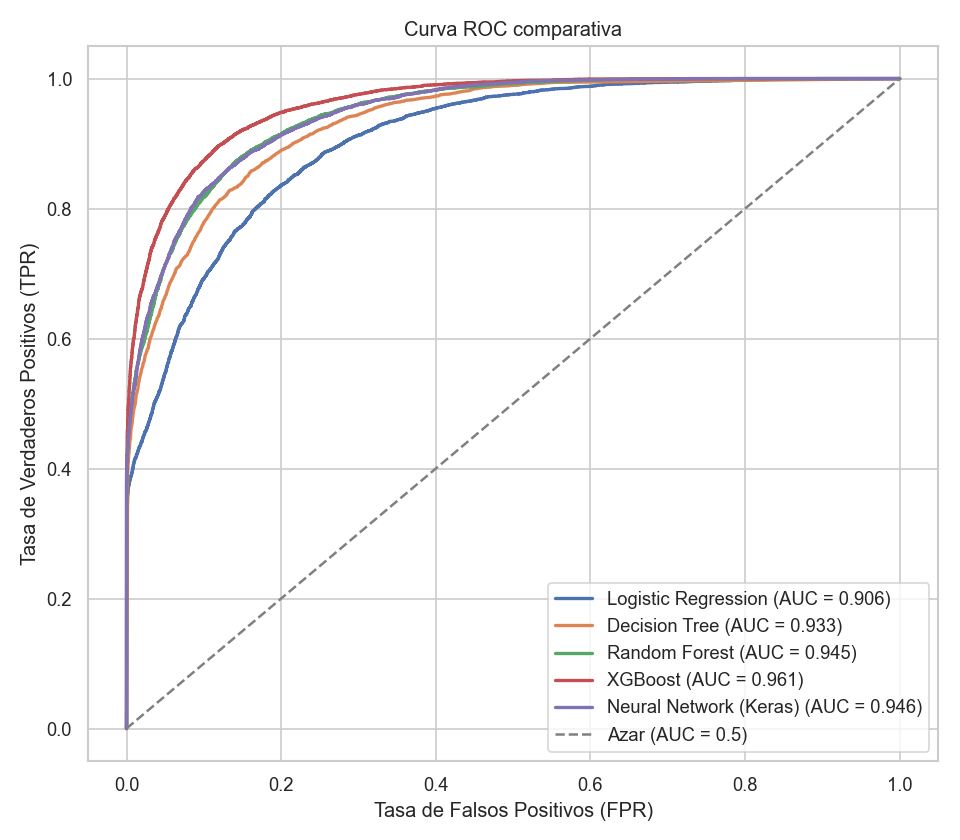
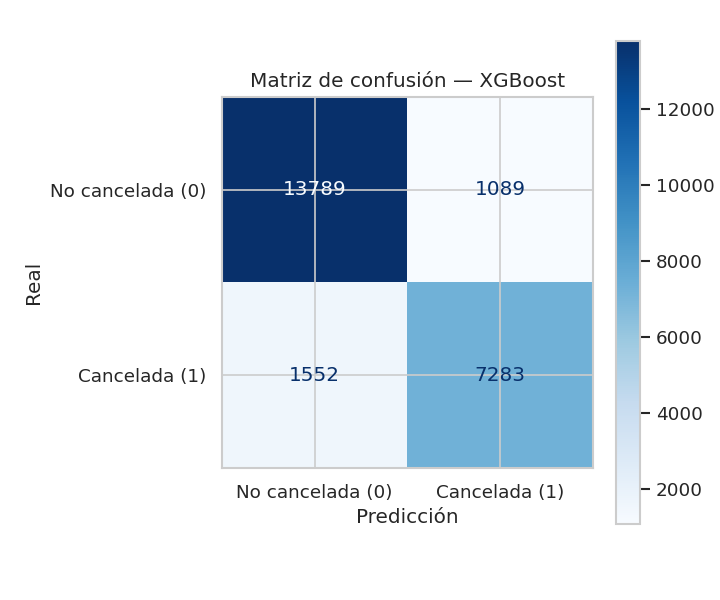
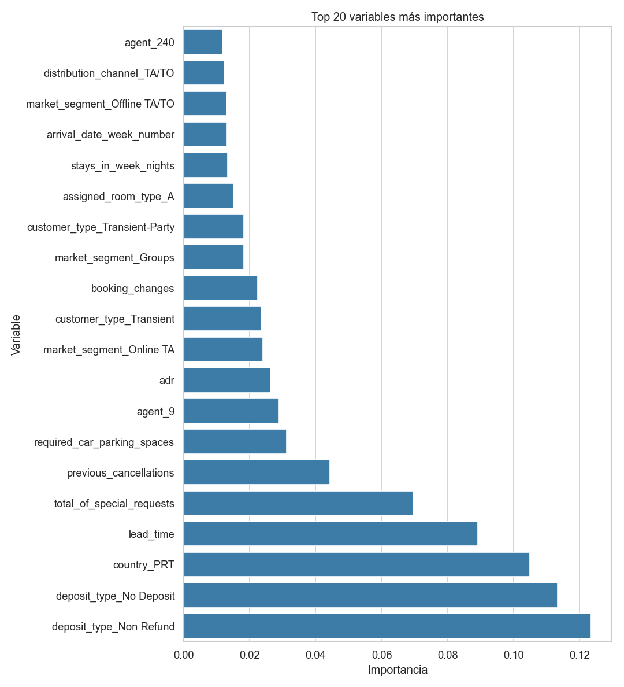

# 🏨 Predicción de cancelaciones de reservas hoteleras

> Sistema automático que **entrena, evalúa y compara** varios modelos de *Machine
> Learning* para predecir si una reserva de hotel se cancelará. Entrega final del
> módulo de **Machine Learning y Deep Learning** (Máster en IA, Cloud Computing y
> DevOps).

**¿Qué hace este proyecto, en una frase?** A partir de los datos de una reserva
(antelación, tipo de hotel, país del cliente, precio, etc.) estima la
**probabilidad de que esa reserva se cancele**.

## 🌐 Demo en vivo

| Componente | URL | Tier |
|---|---|---|
| 🖥️ **Interfaz web** (Streamlit) | <https://pontia-ml-cancellations-manupm87.streamlit.app> | Streamlit Community Cloud (free) |
| 🔌 **API REST** (FastAPI + Swagger) | <https://pontia-api-fi8t.onrender.com/docs> | Render (free) |
| 🧪 **Experimentos MLflow + Registry** | <https://dagshub.com/manupm87/pontia-ml.mlflow> | DagsHub (free) |

> ⏳ La API se duerme tras 15 min sin uso (tier gratis de Render). La primera
> petición tarda ~30-50 s en despertarla; la UI lo indica con un aviso amable.

### Arquitectura, de un vistazo



> Arquitectura completa, con diagramas detallados y la secuencia de una
> predicción: [`docs/arquitectura.md`](docs/arquitectura.md).

> 📖 **¿Eres nuevo/a en Machine Learning?** Cada término técnico se explica en el
> [**Glosario**](docs/glosario.md). Empieza por ahí si algo no te suena.

Vocabulario mínimo para entender este README (todo ampliado en el glosario):

- **Machine Learning (ML):** que un programa **aprenda de ejemplos** en lugar de
  seguir reglas escritas a mano.
- **Clasificación binaria:** predecir una respuesta de **dos valores**; aquí,
  cancelada (`is_canceled = 1`) o no cancelada (`is_canceled = 0`).
- **Modelo:** el "programa que ha aprendido" y hace las predicciones.
- **Característica (*feature*):** cada dato de entrada (una columna).
- **Variable objetivo (*target*):** lo que queremos predecir (`is_canceled`).

---

## 👥 Autores

| Autor | Rol principal |
|-------|---------------|
| **Manuel Pérez** (manugijon@gmail.com) | Ingeniería del sistema, modelado y documentación |
| **[Nombre compañero/a]** (*[email]*) | *[Pendiente de completar — ver `docs/informe_final.md`]* |

> ℹ️ La práctica es por parejas. El reparto detallado de tareas está en
> [`docs/informe_final.md`](docs/informe_final.md). Sustituid el texto entre
> corchetes por los datos reales del/de la segundo/a integrante.

---

## 🎯 El problema y los datos

**¿Por qué predecir cancelaciones?** Una cancelación deja una habitación vacía que
muchas veces ya no se vuelve a vender. Si el hotel sabe **con antelación qué
reservas tienen alto riesgo de cancelarse**, puede reaccionar (aceptar algo de
*overbooking*, pedir un depósito, ofrecer incentivos para que el cliente no anule).
Es, por tanto, un problema **real y con valor de negocio**.

**Los datos.** Un fichero **CSV** (una tabla de texto separada por comas) con
**~119 000 reservas** de un *City Hotel* y un *Resort Hotel* en Portugal
(2015–2017). Cada fila es una reserva; cada columna, una característica. La columna
`is_canceled` es la respuesta a predecir.

Un dato importante: **las clases están desbalanceadas** — alrededor del **37 % de
las reservas se cancelan** y el 63 % no. Esto influye en cómo evaluamos (ver más
abajo).

### Dos decisiones clave que tomamos al mirar los datos

1. **Eliminar columnas que "hacen trampa" (*fuga de información* o *data
   leakage*).** Las columnas `reservation_status` y `reservation_status_date`
   describen lo que **ya pasó** con la reserva (su estado final). Incluirlas sería
   como dejar ver la respuesta al modelo: acertaría casi el 100 %, pero de forma
   inútil. **Se eliminan siempre.**
2. **Tratar los huecos y las columnas poco útiles.** `company` está vacía en el
   ~94 % de las filas → se descarta. Los valores que faltan en otras columnas se
   **rellenan** (*imputación*) y las variables de texto se convierten en números.

El estudio completo de los datos está en
[`notebooks/01_eda.ipynb`](notebooks/01_eda.ipynb) (*EDA = análisis exploratorio de
datos*).

---

## 🗂️ Estructura del proyecto

Separamos el código en módulos (en vez de meter todo en un único notebook) para que
sea más claro, reutilizable y fácil de ejecutar:

```text
pontia-ml/                  # ← repo root (esta carpeta)
├── data/
│   ├── raw/            # Datos originales (dataset_practica_final.csv)
│   └── processed/      # Datos intermedios (se regeneran solos)
├── docs/
│   ├── glosario.md           # 📖 Explicación de todos los términos técnicos
│   ├── informe_final.md      # Informe (roles, EDA, diseño, resultados, mejoras)
│   └── interpretabilidad.md  # Interpretabilidad del modelo con SHAP (bonus)
├── models/             # Modelos entrenados y guardados (ficheros .pkl)
│   └── best_model.pkl  # El mejor modelo, listo para hacer predicciones
├── notebooks/
│   ├── README.md                         # Convención de los notebooks + cómo añadir un modelo
│   ├── 01_eda.ipynb                      # EDA compartido por todos los modelos
│   ├── 02_modelo_regresion_logistica.ipynb  # Un notebook por modelo: teoría +
│   ├── 03_modelo_arbol_decision.ipynb        #   hiperparámetros + entrenamiento +
│   ├── 04_modelo_random_forest.ipynb         #   visualización + optimización
│   ├── 05_modelo_xgboost.ipynb
│   ├── 06_modelo_red_neuronal.ipynb
│   ├── 07_comparativa_modelos.ipynb      # Comparación de los 5 modelos + viz 2D
│   ├── 08_balanceo_clases.ipynb          # Desbalance: class_weight vs SMOTE
│   ├── 09_no_supervisado.ipynb           # Clustering: segmentos de reserva
│   ├── 10_interpretabilidad_shap.ipynb   # Interpretabilidad con SHAP (bonus)
│   ├── playground/                       # Notebook autónomo estilo `recursos/` (XGBoost end-to-end)
│   └── _PLANTILLA_modelo.ipynb           # Plantilla para crear un notebook de modelo
├── outputs/            # Gráficos y tablas que genera el sistema
├── src/                                    # Código fuente (src-layout PyPA)
│   └── ml_hotel_cancellations/             # 📦 El paquete instalable del proyecto
│       ├── config.py        # Fuente única: rutas, columnas, constantes, ejemplo
│       ├── ml/              # 🤖 Pipeline ML (entrenamiento + inferencia + experimentos)
│       │   ├── data_loader.py · preprocessing.py · model_factory.py
│       │   ├── model_trainer.py · evaluator.py
│       │   ├── train.py      # 🚀 Programa principal (--tune opcional)
│       │   ├── predict.py    # Inferencia con el mejor modelo
│       │   └── tuning.py · balancing.py        # bonus (búsqueda CV / balanceo)
│       ├── api/            # 🔌 API REST (FastAPI)
│       │   ├── main.py · schemas.py · service.py
│       │   └── registry.py  # Cliente REST del Model Registry de MLflow
│       ├── ui/             # 🖥️ Interfaz Streamlit
│       │   ├── app.py · config.py · data.py · booking.py · layout.py
│       │   └── sections/    # Una pantalla por sección (resumen, predicción, EDA…)
│       └── utils/          # 🔧 Transversales (reporting, viz 2D, SHAP, MLflow)
│           ├── reporting.py · visualization_2d.py · interpretability.py
│           └── tracking.py · register_model.py
├── tests/              # 🧪 Suite de tests (pipeline + contract tests de fuente única)
├── conftest.py         # Fixtures compartidas (datos sintéticos, modelo, API)
├── pyproject.toml      # Metadatos, dependencias (+extras), scripts y config de pytest
├── requirements.txt    # Una línea `-e .` (para plataformas que solo leen este fichero)
├── render.yaml         # Configuración del despliegue en Render (API)
├── recursos/           # 📚 Material de referencia (no parte del entregable):
│   │                   #    notebooks de clase + enunciado original
│   └── 2.Proyecto Final de Módulo/   # Enunciado y dataset originales
└── README.md
```

> El código vive en un **paquete instalable** (`ml_hotel_cancellations`) bajo
> `src/`, dividido por responsabilidad: `ml/` (pipeline), `api/` (FastAPI),
> `ui/` (Streamlit) y `utils/` (transversales). Se instala con `pip install -e .`.

---

## ⚙️ Preparar el entorno (paso a paso)

Necesitas **Python 3.11 ó 3.12** (recomendado 3.12). El requirements está
pensado para que `pip install -e .` funcione "out of the box"
en **Linux x86_64**, **Windows x86_64** y **macOS** (tanto Intel como Apple
Silicon). El techo lo fija TensorFlow 2.16.2 (última versión con rueda para
macOS x86_64), que arrastra `numpy<2` y los pines compatibles del resto.

> ℹ️ Python 3.13 no se soporta todavía: TensorFlow 2.16 no publica ruedas
> para `cp313`.
>
> 💡 Si usas XGBoost en **macOS** y obtienes un error de `libomp.dylib`,
> instala OpenMP con `brew install libomp`.

Usamos un **entorno virtual** (*venv*): una "caja" aislada donde instalamos las
librerías de este proyecto sin afectar al resto de tu ordenador. Así todos usamos
exactamente las mismas versiones y el código funciona igual en cualquier máquina.

```bash
# 1) Clonar el repo y entrar en él
git clone https://github.com/manupm87/pontia-ml.git
cd pontia-ml

# 2) Crear el entorno virtual (crea la carpeta .venv en la raíz)
python3 -m venv .venv

# 3) Activarlo
source .venv/bin/activate          # Linux / macOS
# .venv\Scripts\activate           # Windows (PowerShell)

# 4) Instalar el paquete (las dependencias están en pyproject.toml)
pip install --upgrade pip
pip install -e .                  # runtime: API + UI + inferencia
pip install -e ".[train,dev]"    # + reentrenar/MLflow (train) y tests (dev)
```

> Cuando el entorno está activado verás `(.venv)` al principio de la línea de tu
> terminal. Para salir de él: `deactivate`.
>
> 💡 Las dependencias se declaran en `pyproject.toml`. La instalación base
> (`pip install -e .`) trae solo lo necesario para **servir** el modelo
> (`xgboost`, `fastapi`, `streamlit`, `shap`…), lo que mantiene el despliegue
> (Render / Streamlit Cloud) ligero. El extra `[train]` añade lo de **entrenar**
> (`tensorflow`, `imbalanced-learn`, `mlflow`) y `[dev]` las herramientas de test.

---

## ▶️ Cómo ejecutar el proyecto

Ejecuta todo desde la raíz del repo (`pontia-ml/`) con el entorno virtual
activado.

### 1. Entrenar y comparar todos los modelos (proceso completo)

```bash
python -m ml_hotel_cancellations.ml.train
```

Este único comando ejecuta el flujo de principio a fin:
**cargar los datos → prepararlos → entrenar los 5 modelos → evaluarlos →
elegir el mejor**. Al terminar guarda automáticamente:

- En `models/`: un fichero `.pkl` por modelo y `best_model.pkl` (el ganador).
  *(Un `.pkl` es un modelo ya entrenado guardado en disco para reutilizarlo.)*
- En `outputs/`: la tabla de métricas (`metricas_modelos.csv`) y los gráficos
  (curva ROC, matrices de confusión e importancia de variables).

#### Optimización de hiperparámetros (bonus)

Los hiperparámetros óptimos **ya están buscados y se usan por defecto**: están
guardados en `outputs/best_hiperparametros.json`, y `python -m ml_hotel_cancellations.ml.train` los
carga automáticamente. Sin ese fichero, el pipeline recurre a unos valores base.

Para **rehacer la búsqueda** por validación cruzada:

```bash
python -m ml_hotel_cancellations.ml.train --tune        # busca, guarda el JSON y entrena con lo mejor
python -m ml_hotel_cancellations.ml.tuning              # solo la búsqueda (escribe el JSON y el informe .md)
```

Usa **GridSearchCV** (regresión logística y árbol) y **RandomizedSearchCV**
(Random Forest y XGBoost), optimizando ROC-AUC por validación cruzada. La
búsqueda parte de unos valores base ya buenos (`max_depth=14, n_estimators=500,
learning_rate=0.1`) y los mejora hasta `max_depth=16, n_estimators=600,
learning_rate=0.03`, alcanzando **0.9614** de ROC-AUC en test; el detalle queda en
`outputs/tuning_hiperparametros.md`.

#### Balanceo de clases (bonus)

Comparamos cómo afecta tratar el desbalance (~37 % de cancelaciones):

```bash
python -m ml_hotel_cancellations.ml.balancing   # escribe outputs/balanceo_clases.md y .png
```

Contrasta **sin balanceo**, **class_weight** (reponderar la clase minoritaria) y
**SMOTE** (sobremuestreo sintético, vía *imbalanced-learn*). Conclusión: ambas
**suben el recall** (se detectan más cancelaciones) a costa de **precisión**,
mientras el **ROC-AUC apenas cambia** (es independiente del umbral). Por eso el
pipeline principal no balancea: optimizamos ROC-AUC y el compromiso
recall/precisión se ajustaría moviendo el umbral según el coste de negocio.

### 2. Predecir con el mejor modelo

```bash
# Demostración rápida: usa 10 reservas de ejemplo del propio dataset
python -m ml_hotel_cancellations.ml.predict --sample 10

# Sobre tu propio fichero CSV de reservas
python -m ml_hotel_cancellations.ml.predict --input mis_reservas.csv --output predicciones.csv
```

Devuelve, para cada reserva, la predicción (0/1) y la **probabilidad** de
cancelación (un número entre 0 y 1).

### 3. Abrir los notebooks (para explorar y aprender)

```bash
# Registrar el entorno como "kernel" de Jupyter (solo la primera vez)
python -m ipykernel install --user --name pontia-ml --display-name "Python (pontia-ml)"
jupyter lab    # o: jupyter notebook
```

> Un **notebook** es un documento interactivo que combina texto, código y
> resultados. El **kernel** es el "motor" de Python que ejecuta su código.

- `notebooks/01_eda.ipynb` — EDA **compartido**: exploramos los datos y explicamos
  cada decisión de preprocesado.
- `notebooks/02`–`06_modelo_*.ipynb` — **un notebook por modelo** (regresión
  logística, árbol, Random Forest, XGBoost, red neuronal), todos con la misma
  estructura: cómo funciona, qué controla cada hiperparámetro, entrenamiento,
  visualización del modelo, optimización y evaluación. Para añadir uno, se copia
  `notebooks/_PLANTILLA_modelo.ipynb` (convención en `notebooks/README.md`).
- `notebooks/07_comparativa_modelos.ipynb` — compara los 5 modelos y muestra los
  gráficos (incluida la visualización 2D: proyección PLS y t-SNE).
- `notebooks/08_balanceo_clases.ipynb` — desbalance de clases: `class_weight` vs
  SMOTE y para qué sirven.
- `notebooks/09_no_supervisado.ipynb` — clustering (K-Means) para descubrir
  segmentos de reserva y su tasa de cancelación.
- `notebooks/10_interpretabilidad_shap.ipynb` — **interpretabilidad (bonus)**:
  explica con **SHAP** por qué el modelo predice cada cancelación.

### 4. Interpretabilidad del modelo con SHAP (bonus)

Explica **por qué** el modelo decide, a nivel global (qué variables pesan más) y
local (una reserva concreta). Genera los gráficos en `outputs/`:

```bash
python -m ml_hotel_cancellations.utils.interpretability
```

Detalles en [`docs/interpretabilidad.md`](docs/interpretabilidad.md) y en el notebook
`10_interpretabilidad_shap.ipynb`.

### 5. API REST con FastAPI (bonus)

Sirve el mejor modelo por HTTP para consumirlo desde otros sistemas:

```bash
uvicorn ml_hotel_cancellations.api.main:app --reload      # desde la raíz del repo
```

Abre la documentación interactiva en <http://127.0.0.1:8000/docs>. Endpoints:
`GET /health`, `GET /model-info`, `POST /predict`, `POST /predict/batch`. Ejemplo:

```bash
curl -X POST http://127.0.0.1:8000/predict -H "Content-Type: application/json" \
  -d '{"hotel":"City Hotel","lead_time":100,"arrival_date_month":"August","arrival_date_week_number":33,"arrival_date_day_of_month":15,"stays_in_weekend_nights":2,"stays_in_week_nights":5,"adults":2,"children":0,"babies":0,"meal":"BB","country":"PRT","market_segment":"Online TA","distribution_channel":"TA/TO","is_repeated_guest":0,"previous_cancellations":0,"previous_bookings_not_canceled":0,"reserved_room_type":"A","assigned_room_type":"A","booking_changes":0,"deposit_type":"No Deposit","agent":"9","days_in_waiting_list":0,"customer_type":"Transient","adr":100.0,"required_car_parking_spaces":0,"total_of_special_requests":1}'
```

Guía completa y contrato en [`api/README.md`](api/README.md).

### 6. Interfaz visual con Streamlit (bonus)

Una web que reúne todo: resultados, gráficos de los modelos, un formulario de
**predicción que consume la API**, interpretabilidad (SHAP) y exploración:

```bash
uvicorn ml_hotel_cancellations.api.main:app --reload      # 1) en una terminal: la API (para predecir)
streamlit run src/ml_hotel_cancellations/ui/app.py            # 2) en otra terminal: la interfaz
```

La URL de la API se configura con la variable `PONTIA_API_URL` (por defecto
`http://localhost:8000`). Guía en [`ui/README.md`](ui/README.md).

### 7. Registro de experimentos con MLflow + DagsHub (bonus)

Cada ejecución de los scripts de entrenamiento se publica como un *run* en un
servidor **MLflow** alojado gratis en **DagsHub**, con sus hiperparámetros,
métricas y artefactos asociados. El modelo ganador se registra en el **Model
Registry** y la API puede servirlo directamente desde ahí en lugar de leer el
pickle versionado.

Activación local (una sola vez):

```bash
# 1) Crea cuenta en dagshub.com, conecta el repo y genera un token (scope: mlflow).
# 2) Copia la plantilla y rellénala:
cp .env.example .env
$EDITOR .env

# 3) En cada terminal donde vayas a entrenar:
set -a; source .env; set +a
```

A partir de entonces, los tres scripts loguean a DagsHub:

```bash
python -m ml_hotel_cancellations.ml.train          # parent run "train_all_models" + 5 child runs
python -m ml_hotel_cancellations.ml.tuning         # parent run "tuning_hyperparameters" + 4 child runs
python -m ml_hotel_cancellations.ml.balancing      # parent run "balancing_strategies" + 12 child runs
python -m ml_hotel_cancellations.utils.register_model # registra el ganador como pontia-cancellations:vN @ Production
```

Sin las variables MLflow, los scripts se comportan **exactamente igual que
antes** (no-op silencioso, no rompen nada).

La API consume el registry si exportas `MLFLOW_MODEL_URI`:

```bash
export MLFLOW_MODEL_URI="models:/pontia-cancellations/Production"
uvicorn ml_hotel_cancellations.api.main:app --reload
curl -s http://127.0.0.1:8000/model-info | python -m json.tool
# → "source": "registry", "version": 1, "stage": "Production", ...
```

Si la descarga falla por cualquier motivo (red, token), la API cae automáticamente
al pickle local y refleja el fallo en `fallback_reason`. La arquitectura
completa del sistema, con diagramas, está en [`docs/arquitectura.md`](docs/arquitectura.md).

### 8. Ejecutar los tests (pytest)

El proyecto incluye una suite de tests que cubre la lógica del pipeline (`ml/`), el
contrato de la API y la lógica de la interfaz, además de unos *contract tests* que
garantizan que las constantes compartidas (etiquetas de clase, umbral de decisión,
reserva de ejemplo, familias de modelo...) tengan una **única fuente de verdad** en
`ml_hotel_cancellations/config.py`.

```bash
# Suite completa
.venv/bin/python -m pytest

# Solo los tests rápidos (omite los que cargan el modelo entrenado)
.venv/bin/python -m pytest -m "not slow"

# Un módulo concreto
.venv/bin/python -m pytest tests/test_contracts.py -q
```

Los tests que cargan el `Pipeline` completo desde disco están marcados con
`@pytest.mark.slow`. La configuración de pytest vive en `pyproject.toml`
(`[tool.pytest.ini_options]`) y las *fixtures* compartidas (DataFrame sintético de
reservas, modelo bundled, cliente de la API) en `conftest.py`.

---

## 📊 Resultados

Medimos cada modelo sobre el **conjunto de prueba** (*test*): un 20 % de los datos
que el modelo **no vio durante el entrenamiento**, para comprobar que generaliza a
casos nuevos. La métrica con la que elegimos el ganador es **ROC-AUC** (explicada
justo debajo).

| Modelo | Accuracy | Precision | Recall | F1 | **ROC-AUC** |
|--------|:--------:|:---------:|:------:|:--:|:-----------:|
| **XGBoost** ⭐ | 0.8934 | 0.8701 | 0.8374 | 0.8535 | **0.9614** |
| Red neuronal (Keras) | 0.8718 | 0.8427 | 0.8045 | 0.8231 | 0.9460 |
| Random Forest | 0.8644 | 0.8828 | 0.7313 | 0.8000 | 0.9455 |
| Árbol de decisión | 0.8551 | 0.8191 | 0.7819 | 0.8000 | 0.9329 |
| Regresión logística | 0.8190 | 0.7312 | 0.8093 | 0.7683 | 0.9064 |

⭐ **Mejor modelo: XGBoost** (ROC-AUC = 0.961). Se guarda como
`models/best_model.pkl`. *(Estas cifras son con los hiperparámetros optimizados,
que el pipeline usa por defecto — ver más abajo.)*

**¿Qué significan estas métricas?** (todas explicadas en el [glosario](docs/glosario.md)):

- **Accuracy (exactitud):** % de aciertos totales. Cuidado: con clases
  desbalanceadas puede engañar.
- **Precision (precisión):** de las que predije como cancelaciones, cuántas lo eran
  de verdad (pocas falsas alarmas).
- **Recall (sensibilidad):** de las cancelaciones reales, cuántas detecté (se
  escapan pocas).
- **F1:** equilibrio entre precisión y recall.
- **ROC-AUC:** número de 0.5 (azar) a 1 (perfecto) que mide cómo de bien **ordena**
  el modelo las reservas por riesgo, **sin depender de un umbral concreto**.

<p align="center">
  
  
</p>
<p align="center">
  
</p>

> - La **curva ROC** muestra el equilibrio entre detectar cancelaciones y generar
>   falsas alarmas; cuanto más pegada a la esquina superior izquierda, mejor.
> - La **matriz de confusión** cruza lo predicho con lo real (aciertos en la
>   diagonal).
> - La **importancia de variables** indica qué características pesan más en las
>   predicciones.

### ¿Por qué elegimos ROC-AUC como métrica principal?

1. **No se deja engañar por el desbalance** (~37 % de cancelaciones): a diferencia
   de la *accuracy*, no se infla por la clase mayoritaria.
2. **No depende del umbral** de decisión: mide la capacidad de ordenar bien las
   reservas, dejando libertad para fijar el corte según la política del hotel.
3. **Permite comparar** modelos de naturaleza muy distinta con un único número.

Como métricas secundarias, de interés para el negocio, reportamos **recall**
(cuántas cancelaciones detectamos) y **F1** (equilibrio precisión/recall).

---

## ✅ Conclusiones

- Los modelos basados en **árboles potenciados** (*XGBoost*) y la **red neuronal**
  son los mejores: capturan relaciones complejas entre variables. XGBoost, además,
  entrena en muy poco tiempo.
- Las características más decisivas (tipo de depósito no reembolsable, antelación de
  la reserva, precio, país, peticiones especiales) coinciden con lo que se observó
  al explorar los datos.
- El sistema queda **automatizado**: un comando entrena, evalúa, elige y guarda el
  mejor modelo; otro permite usarlo para predecir.

El análisis detallado, las limitaciones y las posibles mejoras están en
[`docs/informe_final.md`](docs/informe_final.md).

---

## 🧰 Tecnologías utilizadas

Python 3.11–3.12 · scikit-learn · XGBoost · TensorFlow/Keras · pandas · NumPy ·
matplotlib · seaborn · plotly · Jupyter. Las versiones exactas están en
[`requirements.txt`](requirements.txt). ¿No sabes qué es alguna? Mírala en el
[**glosario**](docs/glosario.md).
