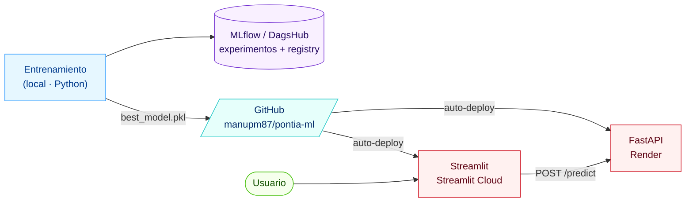

# 🏨 Predicción de cancelaciones de reservas hoteleras

> Sistema automático que **entrena, evalúa y compara** varios modelos de _Machine
> Learning_ para predecir si una reserva de hotel se cancelará. Entrega final del
> módulo de **Machine Learning y Deep Learning** (Máster en IA, Cloud Computing y
> DevOps).

**¿Qué hace este proyecto, en una frase?** A partir de los datos de una reserva
(antelación, tipo de hotel, país del cliente, precio, etc.) estima la
**probabilidad de que esa reserva se cancele**.


---

## 📋 Resumen del proyecto

**El problema:** Las cancelaciones dejan habitaciones vacías sin tiempo de revenderlas. Prediciendo el riesgo con antelación, el hotel puede actuar (overbooking controlado, depósito, incentivos).

**Los datos:** 119 390 reservas × 32 columnas (City Hotel y Resort Hotel, Portugal 2015–2017). Tras limpieza: **94 850** filas de entrenamiento y **23 713** de test. El pipeline acepta **26 características** (15 numéricas + 11 categóricas), deriva 3 adicionales y llega a **144 columnas** tras one-hot encoding. Clases desbalanceadas (~37 % cancelaciones).

**Lo que está implementado:**

- 5 modelos: Regresión logística, Árbol de decisión, Random Forest, XGBoost, Red neuronal (Keras)
- Búsqueda de hiperparámetros: GridSearchCV (LR, árbol) y RandomizedSearchCV (RF, XGBoost)
- API REST con FastAPI (`/predict`, `/predict/batch`, `/model-info`, `/health`)
- Interfaz web con Streamlit (predicción, métricas, gráficos, SHAP)
- Tracking de experimentos con MLflow + DagsHub
- Interpretabilidad con SHAP (global y local)
- Suite de 68 tests (pipeline, API, UI, contract tests)

**Mejor resultado:** XGBoost — ROC-AUC **0.9529** en test.

> 📖 Términos → [glosario.md](docs/glosario.md) · Sistema → [arquitectura.md](docs/arquitectura.md) · Análisis completo → [informe_final.md](docs/informe_final.md)

---

## 🌐 Demo en vivo

| Componente                            | URL                                                     | Tier                             |
| ------------------------------------- | ------------------------------------------------------- | -------------------------------- |
| 🖥️ **Interfaz web** (Streamlit)       | <https://ml-hotel-cancellations-manupm87.streamlit.app> | Streamlit Community Cloud (free) |
| 🔌 **API REST** (FastAPI + Swagger)   | <https://pontia-api-fi8t.onrender.com/docs>             | Render (free)                    |
| 🧪 **Experimentos MLflow + Registry** | <https://dagshub.com/manupm87/pontia-ml.mlflow>         | DagsHub (free)                   |

> ⏳ La API se duerme tras 15 min sin uso (tier gratis de Render). La primera
> petición tarda ~30-50 s en despertarla; la UI lo indica con un aviso amable.

### Arquitectura, de un vistazo


```mermaid
flowchart LR
    classDef dev fill:#e6f7ff,stroke:#1890ff,color:#003a8c
    classDef ml fill:#f9f0ff,stroke:#722ed1,color:#22075e
    classDef repo fill:#e6fffb,stroke:#13c2c2,color:#002766
    classDef cloud fill:#fff1f0,stroke:#cf1322,color:#5c0011
    classDef user fill:#f6ffed,stroke:#52c41a,color:#135200

    DEV["Entrenamiento<br/>(local · Python)"]:::dev
    MLF[("MLflow / DagsHub<br/>experimentos + registry")]:::ml
    REPO[/"GitHub<br/>manupm87/pontia-ml"/]:::repo
    API["FastAPI<br/>Render"]:::cloud
    UI["Streamlit<br/>Streamlit Cloud"]:::cloud
    USER([Usuario]):::user

    DEV --> MLF
    DEV -- "best_model.pkl" --> REPO
    REPO -- auto-deploy --> API
    REPO -- auto-deploy --> UI
    USER --> UI
    UI -- "POST /predict" --> API
```

> Arquitectura completa: [`docs/arquitectura.md`](docs/arquitectura.md) · Términos: [`docs/glosario.md`](docs/glosario.md)

---

## 👥 Autores y roles

| Autor                                         |
| --------------------------------------------- |
| **Manuel Pérez** (manugijon@gmail.com)        |
| **Joaquin Castro** (jcastrosalas03@gmail.com) |

**Reparto del trabajo.** El proyecto se ha desarrollado de forma plenamente
colaborativa: ambos integrantes participaron en **todas las fases** —análisis
exploratorio, diseño del _pipeline_, entrenamiento y comparación de modelos,
productivización (API y UI) y documentación—, trabajando principalmente en
sesiones de _pair programming_ en las que las decisiones técnicas se tomaron y se
pusieron en común de forma conjunta.

---

## 🗂️ Estructura

```text
pontia-ml/                  # ← repo root (esta carpeta)
├── .devcontainer/      # Configuración de contenedor de desarrollo (VS Code)
├── agents/             # Informes y análisis auxiliares del proyecto
├── data/
│   └── raw/            # Datos originales (dataset_practica_final.csv)
├── docs/
│   ├── arquitectura.md       # Arquitectura del sistema (diagramas)
│   ├── glosario.md           # 📖 Explicación de todos los términos técnicos
│   ├── informe_final.md      # Informe (EDA, diseño, resultados, mejoras)
├── memoria/            # Memoria académica en LaTeX y figuras
├── models/             # Modelos entrenados y guardados (ficheros .pkl)
├── notebooks/          # aprender → src (generalizar) → API+UI (mostrar)
│   ├── README.md                           # Explica el arco de tres niveles
│   ├── 01_eda_exploracion.ipynb
│   ├── 02_preparacion_datos.ipynb
│   ├── 03_modelos_supervisados.ipynb
│   ├── 04_red_neuronal.ipynb
│   ├── 05_comparativa_y_visualizacion.ipynb
│   ├── 06_balanceo_clases.ipynb
│   └── 07_interpretabilidad.ipynb
├── outputs/            # Gráficos y tablas que genera el sistema
├── src/                                    # Código fuente (src-layout PyPA)
│   └── ml_hotel_cancellations/             # 📦 El paquete instalable del proyecto
│       ├── config.py        # Fuente única: rutas, columnas, constantes, ejemplo
│       ├── ml/              # 🤖 Pipeline ML (entrenamiento + inferencia + experimentos)
│       │   ├── data_loader.py · preprocessing.py · models.py
│       │   ├── evaluate.py
│       │   ├── train.py      # 🚀 Programa principal (--tune opcional)
│       │   ├── predict.py    # Inferencia con el mejor modelo
│       │   └── tuning.py     # bonus (búsqueda de hiperparámetros por CV)
│       ├── api/            # 🔌 API REST (FastAPI)
│       │   ├── main.py · schemas.py · service.py
│       │   └── registry.py  # Cliente REST del Model Registry de MLflow
│       ├── ui/             # 🖥️ Interfaz Streamlit
│       │   ├── app.py · config.py · data.py · booking.py · layout.py
│       │   └── sections/    # Una pantalla por sección (resumen, predicción, EDA…)
│       └── utils/          # 🔧 Transversales (reporting, viz 2D, SHAP, MLflow)
│           ├── reporting.py · visualization_2d.py · interpretability.py
│           └── tracking.py · register_model.py
├── tests/              # 🧪 Suite de tests (pipeline + contract tests de fuente única)
├── conftest.py         # Fixtures compartidas (datos sintéticos, modelo, API)
├── pyproject.toml      # Metadatos, dependencias (+extras), scripts y config de pytest
├── requirements.txt    # Una línea `-e .` (para plataformas que solo leen este fichero)
├── render.yaml         # Configuración del despliegue en Render (API)
├── recursos/           # 📚 Material de referencia (no parte del entregable):
│   ├── clase_*.ipynb               # Notebooks de clase
│   └── 2.Proyecto Final de Módulo/ # Enunciado y dataset originales
└── README.md
```

---

## ⚙️ Instalación

Requiere **Python 3.11 o 3.12**.

```bash
git clone https://github.com/manupm87/pontia-ml.git && cd pontia-ml
python -m venv .venv
# Linux/macOS
source .venv/bin/activate
# Windows (PowerShell)
# .venv\Scripts\activate
pip install --upgrade pip
pip install -e .                 # API + UI + inferencia
pip install -e ".[train,dev]"   # + entrenamiento, MLflow y tests
```

> macOS + XGBoost: si falla `libomp.dylib` → `brew install libomp`

---

## ▶️ Ejecución

Desde la raíz del repo con el venv activado. En Linux/macOS hay atajos `make` (`make help`).

### 1. Entrenar y comparar todos los modelos (proceso completo)

```bash
python -m ml_hotel_cancellations.ml.train            # entrena 5 modelos, guarda best_model.pkl
python -m ml_hotel_cancellations.ml.train --tune     # rehace búsqueda de hiperparámetros antes
python -m ml_hotel_cancellations.ml.tuning           # solo la búsqueda (GridSearchCV/RandomizedSearchCV)
```

### 2. Predecir con el mejor modelo

```bash
# Demostración rápida: usa 10 reservas de ejemplo del propio dataset
python -m ml_hotel_cancellations.ml.predict --sample 10

# Sobre tu propio fichero CSV de reservas
python -m ml_hotel_cancellations.ml.predict --input mis_reservas.csv --output predicciones.csv
```

### 3. Abrir los notebooks (para explorar y aprender)

```bash
# Registrar el entorno como "kernel" de Jupyter (solo la primera vez)
python -m ipykernel install --user --name pontia-ml --display-name "Python (pontia-ml)"
jupyter lab
```

Los notebooks están en `notebooks/` ([`notebooks/README.md`](notebooks/README.md)): EDA, preparación, modelos supervisados, red neuronal, comparativa, balanceo e interpretabilidad. Son autónomos (no importan `src`).

### 4. Interpretabilidad del modelo con SHAP (bonus)

Explica **por qué** el modelo decide, a nivel global (qué variables pesan más) y
local (una reserva concreta). Genera los gráficos en `outputs/`:

```bash
python -m ml_hotel_cancellations.utils.interpretability
```

Exploración inicial en [`notebooks/07_interpretabilidad.ipynb`](notebooks/07_interpretabilidad.ipynb).

### 5. API REST con FastAPI (bonus)

Sirve el mejor modelo por HTTP para consumirlo desde otros sistemas:

```bash
uvicorn ml_hotel_cancellations.api.main:app --reload      # desde la raíz del repo
```

Abre la documentación interactiva en <http://127.0.0.1:8000/docs>. Endpoints:
`GET /health`, `GET /model-info`, `POST /predict`, `POST /predict/batch`. Ejemplo:

```bash
curl -X POST http://127.0.0.1:8000/predict -H "Content-Type: application/json" \
  -d '{"hotel":"City Hotel","lead_time":100,"arrival_date_month":"August","arrival_date_week_number":33,"arrival_date_day_of_month":15,"stays_in_weekend_nights":2,"stays_in_week_nights":5,"adults":2,"children":0,"babies":0,"meal":"BB","country":"PRT","market_segment":"Online TA","distribution_channel":"TA/TO","is_repeated_guest":0,"previous_cancellations":0,"previous_bookings_not_canceled":0,"reserved_room_type":"A","booking_changes":0,"deposit_type":"No Deposit","agent":"9","company":"no_company","days_in_waiting_list":0,"customer_type":"Transient","adr":100.0,"total_of_special_requests":1}'
```

### 6. Interfaz visual con Streamlit (bonus)

Una web que reúne todo: resultados, gráficos de los modelos, un formulario de
**predicción que consume la API**, interpretabilidad (SHAP) y exploración:

```bash
uvicorn ml_hotel_cancellations.api.main:app --reload      # 1) en una terminal: la API (para predecir)
streamlit run src/ml_hotel_cancellations/ui/app.py            # 2) en otra terminal: la interfaz
```

La URL de la API se configura con la variable `PONTIA_API_URL` (por defecto `http://localhost:8000`).

### 7. MLflow + DagsHub (bonus)

```bash
cp .env.example .env && $EDITOR .env   # añade token DagsHub (scope: mlflow)

# Linux/macOS: cargar variables desde .env en la sesión actual
set -a; source .env; set +a

python -m ml_hotel_cancellations.ml.train             # loguea a DagsHub automáticamente
python -m ml_hotel_cancellations.utils.register_model # registra el ganador en el Model Registry

# API sirve desde el registry (Linux/macOS):
export MLFLOW_MODEL_URI="models:/pontia-cancellations/Production"
uvicorn ml_hotel_cancellations.api.main:app --reload
```

```powershell
# Windows (PowerShell): define variables manualmente en la sesión actual
$env:MLFLOW_TRACKING_URI = "<tu_tracking_uri>"
$env:MLFLOW_TRACKING_USERNAME = "<tu_usuario>"
$env:MLFLOW_TRACKING_PASSWORD = "<tu_token>"
$env:MLFLOW_MODEL_URI = "models:/pontia-cancellations/Production"

python -m ml_hotel_cancellations.ml.train
python -m ml_hotel_cancellations.utils.register_model
uvicorn ml_hotel_cancellations.api.main:app --reload
```

Sin las variables de entorno los scripts funcionan igual (no-op silencioso). Si falla la descarga, la API cae al pickle local.

### 8. Tests

```bash
python -m pytest                          # suite completa (68 tests)
python -m pytest -m "not slow"            # sin tests lentos
python -m pytest tests/test_contracts.py  # contract tests
```

---

## 📊 Resultados

| Modelo               | Accuracy | Precision | Recall |   F1   | **ROC-AUC** |
| -------------------- | :------: | :-------: | :----: | :----: | :---------: |
| **XGBoost** ⭐       |  0.8811  |  0.8593   | 0.8141 | 0.8361 | **0.9529**  |
| Red neuronal (Keras) |  0.8614  |  0.8450   | 0.7691 | 0.8053 |   0.9353    |
| Random Forest        |  0.8562  |  0.8719   | 0.7198 | 0.7886 |   0.9338    |
| Árbol de decisión    |  0.8455  |  0.8219   | 0.7473 | 0.7828 |   0.9235    |
| Regresión logística  |  0.8031  |  0.7233   | 0.7636 | 0.7429 |   0.8862    |

⭐ **Mejor modelo: XGBoost** (ROC-AUC = 0.9529, hiperparámetros optimizados). Se guarda como `models/best_model.pkl`. Métricas sobre el 20 % de test. ROC-AUC como métrica principal por ser robusta ante el desbalance de clases e independiente del umbral. Ver [glosario](docs/glosario.md) para definiciones.

### Conclusiones

El sistema resuelve el problema de principio a fin: del dato crudo a un modelo
servido y explicado en producción. La decisión de diseño más relevante fue
**anteponer la honestidad al número** —eliminar las fugas de _check-in_ detectadas
en el EDA rebaja el ROC-AUC de un 0.9614 engañoso a un **0.9529 realista**—, de
modo que la métrica mide lo que el modelo podrá hacer ante una reserva futura. De
las cinco familias comparadas en igualdad de condiciones gana **XGBoost**, y SHAP
confirma que se apoya en factores con sentido de negocio (depósito no reembolsable,
país, antelación, cancelaciones previas). La línea de mejora más respaldada por el
análisis es **separar el sistema en dos modelos**, uno por tipo de hotel (_City_ y
_Resort_). Análisis completo en [`docs/informe_final.md`](docs/informe_final.md).

<p align="center">
  
  
</p>
<p align="center">
  
</p>

---

## 🧰 Tecnologías

Python 3.11–3.12 · scikit-learn · XGBoost · Keras/TensorFlow · FastAPI · Streamlit · MLflow · SHAP · pandas · NumPy · pytest. Dependencias y rangos en [`pyproject.toml`](pyproject.toml) (y `requirements.txt` instala `-e .` para plataformas que lo requieren).
