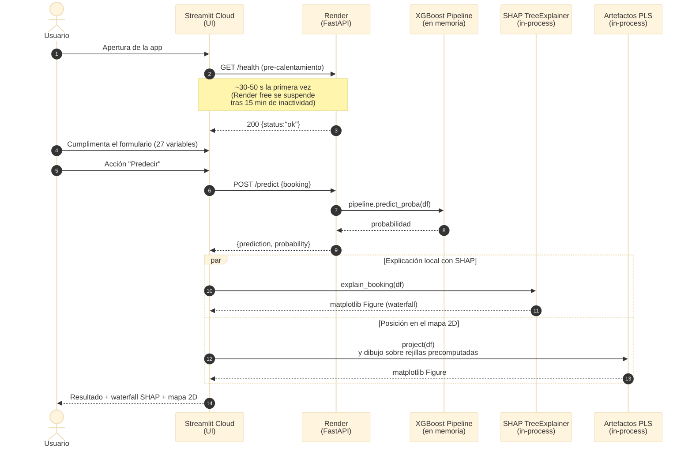

# Arquitectura del sistema

Este documento describe la arquitectura completa del proyecto, desde el ciclo
de experimentación con datos hasta la inferencia servida en producción. Su
objetivo es ofrecer una visión integradora que complementa la descripción
modular del informe ([`informe_final.md`](informe_final.md), §4) y permite
ubicar cada herramienta y artefacto en el contexto de su responsabilidad.

## 1. Visión general: cuatro planos

El sistema se organiza en cuatro **planos** lógicos, cada uno con
responsabilidades, herramientas y artefactos bien delimitados:

| Plano | Responsabilidad | Herramientas | Ubicación |
|---|---|---|---|
| 1. **Experimentación** | Entrenar, evaluar y seleccionar modelos | scripts `train`, `tune`, `balance` (Python 3.12) | Entorno local |
| 2. **Trazabilidad** | Registrar experimentos y versionar modelos | MLflow Tracking + Model Registry | DagsHub (servicio gestionado) |
| 3. **Repositorio** | Persistir código y modelo de producción | Git, GitHub | `manupm87/pontia-ml` |
| 4. **Servicio** | Exponer el modelo y la interfaz al usuario | FastAPI (backend), Streamlit (frontend) | Render + Streamlit Community Cloud |

Esta separación permite que cada plano evolucione de forma independiente: una
nueva iteración de modelado solo afecta a (1) y (2); un cambio en la interfaz
solo afecta a (4); la promoción de una nueva versión del modelo se traduce en
una transición de *stage* en (2) y un *redeploy* automático en (4).

## 2. Diagrama de arquitectura (ciclo completo)

```mermaid
%%{init: {'theme':'base','themeVariables':{'fontSize':'14px'}}}%%
flowchart LR
    classDef data fill:#fff7e6,stroke:#fa8c16,color:#874d00,stroke-width:2px
    classDef train fill:#e6f7ff,stroke:#1890ff,color:#003a8c,stroke-width:2px
    classDef ml fill:#f9f0ff,stroke:#722ed1,color:#22075e,stroke-width:2px
    classDef artifact fill:#e6fffb,stroke:#13c2c2,color:#002766,stroke-width:2px
    classDef cloud fill:#fff1f0,stroke:#cf1322,color:#5c0011,stroke-width:2px
    classDef user fill:#f6ffed,stroke:#52c41a,color:#135200,stroke-width:2px

    DATA[("hotel bookings<br/>~119 k filas")]:::data

    subgraph PLANE1["Plano 1 · Experimentación (local)"]
        direction TB
        T1["train<br/>5 modelos · ROC-AUC"]:::train
        T2["tune<br/>GridSearchCV<br/>RandomizedSearchCV"]:::train
        T3["balance<br/>baseline · class_weight<br/>SMOTE"]:::train
    end
    DATA --> PLANE1

    subgraph PLANE2["Plano 2 · Trazabilidad (MLflow en DagsHub)"]
        direction TB
        EXP[("Experiments<br/>runs · params · metrics")]:::ml
        REG[("Model Registry<br/>pontia-cancellations · v1<br/>stage: Production")]:::ml
        EXP -- promoción --> REG
    end
    PLANE1 -- "log_param · log_metric<br/>log_model · log_artifact" --> EXP

    PKL[("best_model.pkl<br/>XGBoost · 28 MB")]:::artifact
    PLANE1 -- "joblib.dump" --> PKL

    subgraph PLANE3["Plano 3 · Repositorio (GitHub)"]
        REPO[/"manupm87/pontia-ml<br/>src/ml_hotel_cancellations<br/>(ml · api · ui · utils)<br/>models · outputs"/]:::artifact
    end
    PKL --> REPO

    subgraph PLANE4["Plano 4 · Servicio público (free tier)"]
        direction TB
        API_NODE["FastAPI + uvicorn<br/>Render<br/>pontia-api-fi8t.onrender.com"]:::cloud
        UI_NODE["Streamlit<br/>Streamlit Community Cloud<br/>pontia-ml-cancellations-manupm87<br/>.streamlit.app"]:::cloud
    end
    REPO -- "auto-deploy<br/>en cada push" --> API_NODE
    REPO -- "auto-deploy<br/>en cada push" --> UI_NODE

    USER([Usuario · navegador HTTPS]):::user
    USER --> UI_NODE
    UI_NODE -- "POST /predict<br/>JSON" --> API_NODE
    API_NODE -- "{prediction,<br/>probability}" --> UI_NODE
```

### Lectura del diagrama

- **Flujo descendente** del dato (naranja) hacia el servicio público (rojo):
  el dataset alimenta los tres scripts de experimentación, que emiten dos
  artefactos: registros en MLflow (lila) y un *pickle* del modelo ganador
  (cian).
- **Doble destino del pickle**: por un lado se persiste en el repositorio
  (`models/best_model.pkl`) para el despliegue; por otro, su run asociado
  queda registrado en el *Model Registry* de DagsHub bajo el alias
  `pontia-cancellations:1@Production`. Ambas vías son consistentes: el
  *pickle* versionado en GitHub es el mismo objeto registrado en MLflow.
- **Despliegue continuo**: Render y Streamlit Community Cloud observan la
  rama `main` del repositorio y reconstruyen sus servicios al detectar un
  *push*. No hay infraestructura adicional (Docker propio, CI/CD externa).
- **Camino del usuario**: la interfaz Streamlit consume la API de Render
  por HTTPS y compone la respuesta con sus propias visualizaciones
  locales (SHAP *waterfall* y mapa PLS 2D, calculadas en proceso).

## 3. Flujo de una petición de predicción

El siguiente diagrama detalla qué ocurre desde que el usuario abre la
interfaz hasta que ve el resultado de su predicción.

Las dos explicaciones (SHAP y mapa 2D) se ejecutan **en el proceso de
Streamlit**, no en la API. Esta decisión simplifica el contrato de la
API (un único endpoint de predicción) y mantiene el contenedor de Render
en el límite de RAM del *tier* gratuito.

## 4. Detalle por componente

### 4.1 Plano 1 — Experimentación

Tres puntos de entrada en el paquete `ml_hotel_cancellations.ml`
(expuestos como console scripts `train` / `tune` / `balance`):

- `train` (`ml_hotel_cancellations.ml.train`) carga el dataset, construye
  un *Pipeline* de scikit-learn por modelo (preprocesamiento +
  estimador), entrena los cinco modelos exigidos por el enunciado, los
  evalúa sobre el conjunto de test y selecciona el ganador por
  **ROC-AUC** (ver justificación en
  [`informe_final.md`](informe_final.md) §4.1).
- `tune` (`ml_hotel_cancellations.ml.tuning`) optimiza los
  hiperparámetros de los modelos clásicos mediante validación cruzada
  (`GridSearchCV` para los espacios pequeños, `RandomizedSearchCV` para
  los grandes) y persiste los mejores en
  `outputs/best_hiperparametros.json`, de modo que las siguientes
  ejecuciones de `train` los reutilicen por defecto.
- `balance` (`ml_hotel_cancellations.ml.balancing`) compara estrategias
  de balanceo de clases (`baseline`, `class_weight`, SMOTE) para
  cuantificar su efecto sobre *recall*, *precisión* y ROC-AUC.

Los tres scripts comparten una característica importante: si las
variables de entorno de MLflow no están definidas, su comportamiento es
idéntico al de un proyecto sin instrumentación de *tracking*. El helper
`ml_hotel_cancellations.utils.tracking` actúa como adaptador silencioso
(*no-op*) hasta que detecta credenciales, momento en el cual cada
ejecución pasa a publicar un árbol de *runs* en DagsHub.

### 4.2 Plano 2 — Trazabilidad con MLflow

Se utiliza el servidor MLflow alojado por **DagsHub** como solución
gratuita y pública. La instrumentación produce:

| Script | *Parent run* | *Child runs* | Datos registrados |
|---|---|---|---|
| `train` | `train_all_models` | 5 (uno por modelo) | `params`, `metrics`, `train_time_s`, modelo ganador como artefacto sklearn |
| `tune` | `tuning_hyperparameters` | 4 (uno por modelo clásico) | mejores `params`, `cv_default`, `cv_tuned`, `improvement`, `n_combos_tried` |
| `balance` | `balancing_strategies` | 12 (estrategia × modelo) | métricas test + *tags* `strategy` y `model_family` |

La promoción a producción se realiza con `register-model`
(`ml_hotel_cancellations.utils.register_model`), un CLI
que registra el último *run* `train_all_models` como nueva versión del
*Registered Model* `pontia-cancellations` y transiciona dicha versión
al *stage* `Production`. Este paso se ejecuta vía API de MLflow porque
la interfaz web de DagsHub no expone los controles correspondientes
(limitación documentada de su fork).

### 4.3 Plano 3 — Repositorio y artefacto

El modelo ganador se persiste en `models/best_model.pkl` (28 MB) y se
versiona en GitHub. Esta decisión tiene dos motivos prácticos:

1. **Resiliencia del servicio público**: la API utiliza el *pickle* del
   repositorio como mecanismo de carga por defecto y como red de
   seguridad si la descarga desde el *Model Registry* fallara
   (ver §4.4).
2. **Reproducibilidad del entregable**: cualquier clon del repositorio
   contiene el modelo exacto referenciado por el informe, sin requerir
   credenciales externas para ejecutarlo.

El fichero `outputs/decision_regions_pls.pkl` (5 MB) se versiona por la
misma razón: la interfaz lo necesita en tiempo de ejecución para situar
una reserva del usuario sobre el mapa de regiones de decisión.

### 4.4 Plano 4 — Servicio público

#### Backend: FastAPI sobre Render

La API (`ml_hotel_cancellations/api/`) implementa cuatro *endpoints*:

- `GET /health` — sonda de salud, retorna `{status, model_loaded}`.
- `GET /model-info` — metadatos del modelo servido: tipo, métrica
  principal, características esperadas y, crucialmente, **origen del
  modelo cargado** (`source`, `registry_uri`, `version`, `stage`,
  `fallback_reason`).
- `POST /predict` — predicción para una reserva.
- `POST /predict/batch` — predicción para una lista de reservas.

La carga del modelo (`api.service.get_model`) implementa una **cadena
de respaldo**:

1. Si la variable de entorno `MLFLOW_MODEL_URI` está definida, se
   resuelve mediante llamadas HTTP directas al API REST de MLflow
   (sin importar la librería `mlflow` para evitar su huella de memoria),
   se descarga `model.pkl` a `/tmp/pontia_models/<hash>/` y se
   deserializa con `joblib.load`.
2. Si el paso 1 falla por cualquier motivo, se carga el *pickle*
   versionado en el repositorio y se registra el motivo del fallo en
   `fallback_reason`, expuesto por `/model-info`.

En el despliegue actual de Render, el camino del *Model Registry* está
**deshabilitado** (la variable `MLFLOW_MODEL_URI` no se define) porque
la suma de FastAPI, scikit-learn, XGBoost, el *pickle* cargado y la
descarga vía red excede los 512 MB de RAM del tier gratuito. La cadena
de respaldo está exhaustivamente probada en entorno local y queda
disponible sin cambios de código en el momento en que se migre la API
a un servicio con mayor capacidad.

#### Frontend: Streamlit Community Cloud

La interfaz (`ml_hotel_cancellations/ui/`) está organizada en módulos por sección:

- **Resumen y resultados** (`sections/resumen.py`): cifras clave, tabla
  comparativa de los cinco modelos, curvas ROC, matrices de confusión
  e importancia de variables.
- **Visualización de los modelos** (`sections/visualizaciones.py`):
  catálogo completo de figuras del *pipeline* — entre ellas, el mapa
  de regiones de decisión 2D obtenido por proyección PLS supervisada.
- **Predicción** (`sections/prediccion.py`): formulario con las 27
  variables; tras la predicción API, la sección añade dos explicaciones
  locales calculadas en proceso (waterfall SHAP de la reserva y su
  posición sobre el mapa 2D).
- **Interpretabilidad** (`sections/interpretabilidad.py`): gráficos
  SHAP globales y locales precomputados.
- **Exploración (EDA)** (`sections/eda.py`): tasas de cancelación por
  categoría y balance de clases.

La URL pública de la API se inyecta como *secret* de Streamlit Cloud
(`PONTIA_API_URL`), permitiendo cambiarla sin tocar código. Cuando la
URL apunta a un servicio remoto, la app dispara un pre-calentamiento
asíncrono al cargar y muestra un mensaje contextual mientras Render
arranca el contenedor suspendido.

### 4.5 Despliegue continuo

No se utiliza una herramienta de CI/CD externa (GitHub Actions, etc.):
ambos proveedores observan la rama `main` y reconstruyen
automáticamente al detectar nuevos *commits*. Los ficheros de
configuración relevantes son:

- `render.yaml` — *blueprint* declarativo: runtime Python 3.12,
  `requirements.txt`, comando `uvicorn`, `/health` como sonda.
- Las credenciales sensibles (`MLFLOW_TRACKING_*`,
  `PONTIA_API_URL`) se configuran en los respectivos paneles, no en el
  repositorio.

## 5. Decisiones técnicas relevantes

### 5.1 División de dependencias

Las dependencias se declaran en `pyproject.toml` y se dividen en dos
niveles mediante *extras*:

- **Base** (`pip install -e .`) — *runtime*: lo estrictamente necesario
  para servir la API y la UI (≈ 350 MB instalados).
- **Extra `[train]`** (`pip install -e ".[train]"`): TensorFlow/Keras,
  *imbalanced-learn*, Jupyter, MLflow (cliente completo). Solo se
  necesitan para reentrenar o publicar nuevos *runs* en DagsHub. El extra
  `[dev]` añade además las herramientas de test (`pytest`, `httpx`).
  El fichero `requirements.txt` es solo `-e .` (para plataformas que solo
  leen ese fichero, como Render o Streamlit Cloud).

Esta división mantiene el contenedor de Render por debajo del límite
de RAM del *tier* gratuito y reduce el tiempo de build de cada
despliegue.

### 5.2 Carga del *Model Registry* por REST puro

`api/service.py` interactúa con DagsHub sin importar la librería
`mlflow`. La razón es estrictamente de huella de memoria: cargar
`mlflow` (completo) o `mlflow-skinny` añade ~50-150 MB de RSS al
proceso, suficiente para superar el límite de Render free. Como el
servicio solo necesita dos llamadas HTTP
(`/api/2.0/mlflow/registered-models/get`,
`/api/2.0/mlflow-artifacts/artifacts/.../model.pkl`) y deserializar el
*pickle* con `joblib.load`, sustituirlas por cliente HTTP nativo es
funcionalmente equivalente y notablemente más ligero.

### 5.3 Parche puntual SHAP 0.49 ↔ XGBoost ≥ 2.x

El *pin* de versiones del proyecto está condicionado por TensorFlow
2.16.2, que exige `numpy<2`. Esta restricción arrastra a su vez
`shap<0.50`, versión que no soporta el formato actual del campo
`base_score` que XGBoost ≥ 2.x serializa como `"[0.37]"` (con
corchetes). `ml_hotel_cancellations/utils/interpretability.py` aplica un *monkey-patch*
idempotente al decodificador UBJ de SHAP que normaliza el valor antes
de que SHAP intente convertirlo a `float`.

### 5.4 Visualización 2D con persistencia de artefactos

El mapa de regiones de decisión 2D requiere reentrenar versiones
ligeras de los cinco modelos sobre una proyección PLS supervisada,
proceso que toma ~45 segundos. Para evitar ese coste en cada inicio de
la UI, `ml_hotel_cancellations.utils.visualization_2d` precalcula y persiste:

- El preprocesador, el ajuste PLS y el signo de orientación de la
  primera componente.
- Una rejilla 300 × 300 con la probabilidad predicha por cada modelo
  (cinco `numpy.ndarray` de `float32`).
- La submuestra de puntos de test que se dibuja sobre las regiones.

El resultado se serializa con `joblib` en
`outputs/decision_regions_pls.pkl` (5 MB). En tiempo de ejecución, la
UI solo proyecta una reserva al plano y superpone el marcador
correspondiente, operación que toma milisegundos.

## 6. Cómo acceder al sistema en producción

| Recurso | URL |
|---|---|
| Interfaz web (Streamlit) | <https://ml-hotel-cancellations-manupm87.streamlit.app> |
| API + documentación Swagger | <https://pontia-api-fi8t.onrender.com/docs> |
| API: sonda de salud | <https://pontia-api-fi8t.onrender.com/health> |
| API: metadatos del modelo | <https://pontia-api-fi8t.onrender.com/model-info> |
| Servidor MLflow + Model Registry | <https://dagshub.com/manupm87/pontia-ml.mlflow> |
| Código fuente | <https://github.com/manupm87/pontia-ml> |

> **Nota sobre latencia.** La primera petición tras un periodo de
> inactividad superior a 15 minutos puede tardar 30-50 segundos en
> responder, durante los cuales Render reactiva el contenedor de la
> API. La interfaz lo detecta y muestra un aviso contextual; las
> peticiones subsiguientes responden en decenas de milisegundos.
