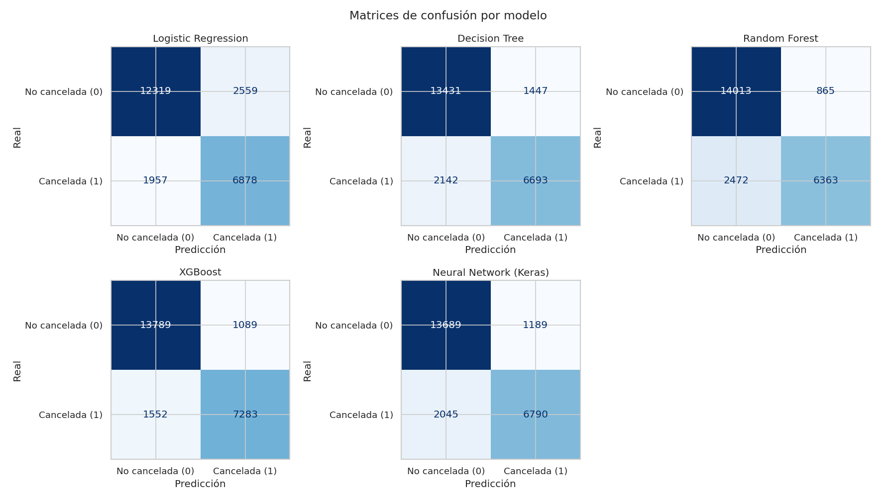

# Informe final — Predicción de cancelaciones de reservas hoteleras

**Máster en IA, Cloud Computing y DevOps · Módulo de Machine Learning y Deep Learning**

> 📖 Todos los términos técnicos que aparecen en este informe están explicados, en
> lenguaje sencillo, en el [**Glosario**](glosario.md). Si lees una palabra que no
> conoces, búscala allí.

---

## 1. Roles de la pareja

La práctica se ha realizado por parejas. El reparto de tareas ha sido el siguiente
(rellenar/ajustar con los datos reales del/de la segundo/a integrante):

| Integrante | Responsabilidades principales | Aportaciones concretas |
|------------|-------------------------------|------------------------|
| **Manuel Pérez** (manugijon@gmail.com) | Arquitectura del sistema, modelado y documentación | Diseño del paquete `src/`, proceso de entrenamiento (`train.py`), integración de la red neuronal, evaluación y redacción de README/informe/glosario |
| **[Nombre compañero/a]** (*[email]*) | *[p. ej.: exploración de datos, preprocesado y validación]* | *[p. ej.: notebook de análisis exploratorio, diseño del preprocesado, pruebas de modelos, revisión de resultados]* |

> La contribución individual es trazable mediante el **historial de commits** (el
> registro de cambios) del repositorio. Si no se distinguen roles, ambos integrantes
> reciben la misma nota (según el enunciado).

---

## 2. Justificación del problema

Las **cancelaciones de reservas** son un problema económico de primer orden en el
sector hotelero. Una cancelación tardía deja una habitación vacía que difícilmente
se vuelve a vender, distorsiona la previsión de ocupación y complica la gestión de
personal y recursos. La práctica habitual para mitigarlo —el *overbooking* (aceptar
más reservas de las plazas disponibles contando con que algunas se cancelarán)— solo
es segura si se puede **estimar el riesgo de cancelación** de cada reserva.

Por eso predecir `is_canceled` (la *variable objetivo*, lo que queremos adivinar) es
un caso de uso **realista y de alto valor**:

- **Aplicación directa:** priorizar reservas para *overbooking*, lanzar campañas de
  retención o pedir un depósito a las reservas de mayor riesgo.
- **Respuesta de dos valores (clasificación binaria):** cancelada (1) o no (0).
- **Datos ricos:** ~119 000 reservas y 31 *características* (columnas) de tipos muy
  distintos: temporales, categóricas (texto) y numéricas, ideales para ilustrar un
  preprocesado completo y comparar modelos.

---

## 3. Análisis exploratorio de datos (EDA)

El **EDA** (*Exploratory Data Analysis*) es la fase en la que exploramos los datos
con tablas y gráficos **antes de modelar**, para entenderlos y tomar decisiones con
fundamento. El análisis completo y reproducible está en
[`notebooks/01_eda.ipynb`](../notebooks/01_eda.ipynb). Principales hallazgos y la
decisión de diseño que provocó cada uno:

### 3.1. La variable objetivo está desbalanceada

- **~37 % de las reservas se cancelan** (44 224 de 119 390); el 63 % no. A esto se
  le llama **desbalance de clases**.
- *Decisión:* usar una **partición estratificada** (mantener ese 37 % tanto en los
  datos de entrenamiento como en los de prueba) y elegir **ROC-AUC** como métrica
  principal en lugar de la *accuracy* (ver sección 5).

### 3.2. Hay columnas que "hacen trampa" (*fuga de información*)

La **fuga de información** (*data leakage*) ocurre cuando el modelo usa, sin querer,
datos que revelan la respuesta o que no existirían en el momento de predecir.

- `reservation_status` vale `Canceled`/`No-Show` **exactamente** cuando
  `is_canceled = 1`. Junto con `reservation_status_date`, describen lo que pasó
  **después** de decidir la cancelación.
- *Decisión:* eliminar ambas columnas siempre. Si no, el modelo "vería la
  respuesta" y obtendría un ~100 % de acierto **engañoso e inútil**.

### 3.3. Valores ausentes (huecos en los datos)

Un **valor ausente** (o nulo, *NaN*) es una celda vacía. La **imputación** es
rellenarla con un valor razonable.

| Columna | % de huecos | Qué hacemos |
|---------|:-----------:|-------------|
| `company` | ~94 % | **Eliminar** (apenas aporta información) |
| `agent` | ~14 % | Tratar como categoría; huecos → `"Unknown"` (desconocido) |
| `country` | ~0.4 % | Imputar con la constante `"Unknown"` |
| `children` | residual | Imputar con la **mediana** (el valor central) |

### 3.4. Variables numéricas

- `lead_time` (días de antelación entre la reserva y la llegada) es la numérica que
  **más se relaciona** con la cancelación: a más antelación, más probabilidad de
  cancelar.
- `total_of_special_requests` y `required_car_parking_spaces` se relacionan al
  revés (clientes más comprometidos cancelan menos).
- Como las variables están en escalas muy diferentes, aplicamos
  **estandarización** (ponerlas todas en una escala comparable, media 0 y
  desviación 1).

**Descartamos `arrival_date_year`.** El dataset tiene cuatro variables de fecha de
llegada (`year`, `month`, `week_number`, `day_of_month`). Las tres últimas aportan
**estacionalidad** (épocas del año en que se cancela más o menos), pero el **año**
no aporta valor real, por tres motivos:

- **Apenas discrimina:** la tasa de cancelación es casi idéntica los tres años
  (2015: 37.0 %, 2016: 35.9 %, 2017: 38.7 %).
- **No generaliza:** el modelo debe puntuar reservas *futuras*. Un año que no vio al
  entrenar (2018 en adelante) no tiene un valor de "año" interpretable: los árboles
  lo meterían en el último tramo conocido y un modelo lineal extrapolaría una
  tendencia inexistente.
- **Va confundido con la estación:** el dataset cubre **años parciales** (2015 solo
  jul–dic; 2017 solo ene–ago), de ahí que el año tenga una correlación de **−0.54**
  con `week_number` (la más alta de todas las numéricas). Esa señal estacional ya la
  recogen `month` y `week_number`, que **sí se repiten** cada año.

*Decisión:* eliminar `arrival_date_year`. En una partición aleatoria, incluirla
subía el ROC-AUC de XGBoost en ~0.003, pero es una mejora **engañosa** (optimismo
que no se trasladaría a producción, donde siempre se predice el futuro). Renunciar a
ella hace el modelo más honesto, en línea con la limitación de *validación temporal*
de la §7.

### 3.5. Variables categóricas (de texto)

- `deposit_type = "Non Refund"` (depósito no reembolsable) tiene una tasa de
  cancelación **cercana al 99 %**: una variable muy predictiva.
- El *City Hotel* cancela más que el *Resort Hotel*.
- Algunas categóricas tienen **muchísimos valores distintos** (*alta cardinalidad*):
  `country` (178 países) y `agent` (334 agencias). Para convertirlas en números sin
  crear cientos de columnas, usamos **codificación one-hot con un límite de
  categorías** (las menos frecuentes se agrupan en una sola).

### 3.6. Limpieza adicional

- Eliminamos ~180 reservas **sin ningún huésped** (`adults+children+babies = 0`),
  que son registros claramente erróneos.

---

## 4. Diseño del sistema

El proyecto está construido como un **paquete de software modular** (la carpeta
`src/`), separando cada responsabilidad en un fichero, en lugar de amontonar todo en
un único notebook.

> Esta sección describe el diseño del **paquete de modelado**. Para una
> visión de arquitectura que abarca todo el sistema —entrenamiento,
> trazabilidad MLflow, repositorio y servicio público— véase
> [`arquitectura.md`](arquitectura.md), con diagramas detallados.

### 4.1. El flujo de trabajo (*pipeline*)

Un **pipeline** ("tubería") es una secuencia de pasos encadenados. El nuestro va de
los datos crudos hasta el modelo elegido:

```text
 CSV crudo ──► data_loader ──► preprocessing ──► model_trainer ──► evaluator ──► best_model.pkl
              (cargar +        (preparar los     (entrenar los     (medir y
               limpiar +        datos: rellenar    5 modelos)        comparar:
               dividir en       huecos, escalar                      ROC, matriz de
               train/test)      y codificar)                         confusión...)
```

### 4.2. Para qué sirve cada módulo

| Módulo (fichero) | Responsabilidad |
|------------------|-----------------|
| `config.py` | Punto único de configuración: rutas, semilla aleatoria, listas de columnas, ajustes (*hiperparámetros*) de los modelos y métrica principal. |
| `data_loader.py` | Cargar el CSV, marcar los huecos, eliminar las columnas que "hacen trampa" y `company`, limpiar y **dividir** en entrenamiento/prueba de forma estratificada. |
| `preprocessing.py` | Construir el preprocesador: **imputar + estandarizar** las numéricas y **codificar (one-hot)** las categóricas. |
| `model_trainer.py` | Clase `ModelTrainer` que envuelve cada modelo en un `Pipeline` (preprocesado + modelo) y los entrena; incluye un envoltorio para que la red neuronal de Keras se comporte como el resto. |
| `evaluator.py` | Clase `Evaluator`: calcula las métricas, monta la tabla comparativa, elige el mejor modelo y dibuja los gráficos. |
| `train.py` | **Programa principal** que ejecuta todo el flujo y guarda los resultados. |
| `predict.py` | Hacer predicciones con `best_model.pkl` sobre reservas nuevas. |

### 4.3. Decisiones de ingeniería destacables (y por qué)

- **Uso de `Pipeline`:** encadenar preprocesado + modelo en un solo objeto tiene una
  ventaja clave: el preprocesado **aprende solo de los datos de entrenamiento**, lo
  que evita *fugas de información* hacia los datos de prueba. Además, modelo y
  preprocesado se guardan juntos y la predicción es directa.
- **Comparación justa:** los cinco modelos comparten **exactamente el mismo
  preprocesado**.
- **Red neuronal integrada:** creamos un envoltorio (`KerasMLPClassifier`) para que
  la red de Keras tenga la misma interfaz (`fit`/`predict`) que los modelos de
  scikit-learn y se pueda **guardar y reutilizar** igual que ellos.
- **Reproducibilidad:** fijamos la **semilla aleatoria** (`random_state = 42`) en
  las divisiones y en los modelos para que los resultados se puedan repetir.

### 4.4. Los cinco modelos que comparamos

Cada uno representa una "familia" distinta de algoritmos (todos explicados en el
[glosario](glosario.md)):

1. **Regresión logística** — modelo lineal sencillo; sirve de **línea base**
   (referencia mínima a superar).
2. **Árbol de decisión** — una serie de preguntas tipo "sí/no"; fácil de entender.
3. **Random Forest ("bosque aleatorio")** — combina **muchos árboles** y promedia
   sus votos (técnica llamada *ensemble*).
4. **XGBoost** — variante muy eficiente de *gradient boosting*: añade árboles que
   van **corrigiendo los errores** de los anteriores.
5. **Red neuronal multicapa (MLP, con Keras/TensorFlow)** — capas de "neuronas"
   `64-32-16`, con *dropout* 0.3 (apaga neuronas al azar para no sobreajustar),
   activación ReLU, salida *sigmoide* (da una probabilidad) y **early stopping**
   (para de entrenar cuando deja de mejorar).

### 4.5. Herramientas de producción y su equivalente en clase (`recursos/`)

El paquete `src/` está pensado como **sistema de producción**, así que en varios
puntos usa utilidades de scikit-learn más robustas que las vistas en los notebooks
de clase (`recursos/`). Cada una **hace lo mismo** que su equivalente de clase,
pero de forma reproducible y segura para la inferencia. Esta tabla las mapea (es la
documentación explícita de por qué `src/` se aparta de `recursos/`):

| Herramienta en `src/` (producción) | Equivalente en `recursos/` | Qué añade la versión de producción |
|---|---|---|
| `Pipeline(preprocessor, modelo)` | entrenar el modelo directamente sobre el DataFrame ya preparado a mano | Empaqueta preprocesado + modelo en **un único objeto**: el preprocesado se **aprende solo del train** (sin fugas) y se persiste junto al modelo para predecir. |
| `ColumnTransformer` | preparar cada grupo de columnas por separado con pandas | Aplica transformaciones distintas a numéricas y categóricas de forma declarativa dentro del `Pipeline`. |
| `OneHotEncoder(handle_unknown=…, max_categories=25)` | `pd.get_dummies(X)` | Recuerda las categorías del *train*, **tolera categorías no vistas** al predecir y **limita la cardinalidad** (evita cientos de columnas). |
| `SimpleImputer(strategy=…)` | `.fillna()` / `.dropna()` | Aprende el valor de relleno (p. ej. la mediana) **en train** y lo reaplica idéntico en test/predicción. |
| `StandardScaler` (todas las numéricas) | `StandardScaler` (solo KNN/SVM en clase) | Es la **misma** herramienta; en producción se aplica a todas las numéricas dentro del `Pipeline` por consistencia. |
| `RandomizedSearchCV` (Random Forest, XGBoost) | `GridSearchCV` | Muestrea combinaciones al azar cuando el espacio es grande, donde una búsqueda exhaustiva sería inviable. En los espacios pequeños (regresión logística, árbol) sí usamos `GridSearchCV`, **igual que en clase**. |

> El notebook `notebooks/playground/` replica el flujo **solo con las herramientas
> de `recursos/`** (`pd.get_dummies`, `GridSearchCV`, etc.), de modo que sirve de
> puente entre la versión "de clase" y la versión "de producción" de `src/`.

---

## 5. Resultados y elección final

Evaluamos sobre el **conjunto de prueba** (*test*): 23 842 reservas (20 % del total)
que el modelo **no usó al entrenar**, para medir si generaliza a casos nuevos.

| Modelo | Accuracy | Precision | Recall | F1 | **ROC-AUC** |
|--------|:--------:|:---------:|:------:|:--:|:-----------:|
| **XGBoost** ⭐ | 0.8934 | 0.8701 | 0.8374 | 0.8535 | **0.9614** |
| Red neuronal (Keras) | 0.8718 | 0.8427 | 0.8045 | 0.8231 | 0.9460 |
| Random Forest | 0.8644 | 0.8828 | 0.7313 | 0.8000 | 0.9455 |
| Árbol de decisión | 0.8551 | 0.8191 | 0.7819 | 0.8000 | 0.9329 |
| Regresión logística | 0.8190 | 0.7312 | 0.8093 | 0.7683 | 0.9064 |

> Estas cifras se obtienen con los **hiperparámetros optimizados** por validación
> cruzada (ver §6, bonus), que el pipeline usa por defecto.

> **Recordatorio de métricas** (detalle en el [glosario](glosario.md)):
> *accuracy* = % de aciertos · *precision* = pocas falsas alarmas · *recall* = se
> escapan pocas cancelaciones · *F1* = equilibrio de las dos · *ROC-AUC* = capacidad
> de ordenar bien por riesgo (0.5 = azar, 1 = perfecto).


*La curva ROC enfrenta cancelaciones detectadas (eje Y) frente a falsas alarmas (eje
X) según el umbral; cuanto más cerca de la esquina superior izquierda, mejor.*



*La matriz de confusión cruza lo predicho con lo real: los aciertos están en la
diagonal.*


*La importancia de variables indica qué características influyen más en las
predicciones del Random Forest.*

### 5.1. Elección del modelo y de la métrica

- **Métrica principal: ROC-AUC.** Es robusta al desbalance, no depende del umbral de
  decisión (lo que permite ajustar la "agresividad" del *overbooking*) y es
  comparable entre modelos. Reportamos además *recall* y *F1* por su lectura de
  negocio.
- **Modelo elegido: XGBoost** (ROC-AUC = 0.961). Supera al resto en la métrica
  principal y en F1, y aun así entrena en pocos segundos (~3.6 s). Se guarda como
  `models/best_model.pkl`.

### 5.2. Qué significan estos resultados para el hotel

- XGBoost detecta el **84 % de las cancelaciones reales** (*recall* 0.84) con una
  **precisión del 87 %**: un buen equilibrio para actuar sin generar demasiadas
  falsas alarmas.
- El Random Forest es el más **conservador** (más precisión pero menos recall):
  preferible si una falsa alarma fuese muy costosa.

---

## 6. Bonus técnicos implementados

Más allá de los requisitos mínimos, añadimos los siguientes extras (el enunciado
los puntúa como *bonus*).

### 6.1. Optimización de hiperparámetros

Buscamos automáticamente la mejor configuración de cada modelo clásico mediante
**validación cruzada** (3 particiones), optimizando ROC-AUC:

- **GridSearchCV** (búsqueda exhaustiva) para los espacios pequeños: regresión
  logística y árbol de decisión.
- **RandomizedSearchCV** (muestreo aleatorio) para los grandes: Random Forest y
  XGBoost.

Los mejores hiperparámetros se **persisten** en `outputs/best_hiperparametros.json`
y el pipeline los **usa por defecto** (`python -m ml_hotel_cancellations.ml.train`); rehacer la búsqueda
es tan simple como `python -m ml_hotel_cancellations.ml.train --tune` o `python -m ml_hotel_cancellations.ml.tuning`. Partiendo
de unos valores base ya buenos hallados explorando a mano
(`max_depth=14, n_estimators=500, learning_rate=0.1`; **0.9573** de ROC-AUC en
validación cruzada), el finetuning encontró
`max_depth=16, n_estimators=600, learning_rate=0.03`, subiendo el ROC-AUC de CV a
**0.9586** y alcanzando **0.9614 en test** (el mejor resultado del proyecto). El
detalle (CV base vs. optimizada) queda en `outputs/tuning_hiperparametros.md`.
Implementado en `src/ml_hotel_cancellations/ml/tuning.py`.

> *Nota de hardware:* todo el entrenamiento se ejecuta en **CPU**, porque a
> esta escala de datos la GPU no acelera y la CPU es plenamente reproducible
> (semilla `RANDOM_STATE=42`).

### 6.2. Balanceo de clases

El problema está moderadamente desbalanceado (~37 % de cancelaciones). Comparamos
tres estrategias (`src/ml_hotel_cancellations/ml/balancing.py`, resultados en `outputs/balanceo_clases.md`
y `.png`): **sin balanceo**, **class_weight** (reponderar la clase minoritaria;
`scale_pos_weight` en XGBoost) y **SMOTE** (sobremuestreo sintético con
*imbalanced-learn*, aplicado solo al entrenamiento).

| XGBoost | recall | precision | ROC-AUC |
|---|:--:|:--:|:--:|
| Sin balanceo | 0.81 | 0.86 | 0.952 |
| class_weight | **0.87** | 0.81 | 0.952 |
| SMOTE | 0.83 | 0.84 | 0.950 |

**Conclusión:** el balanceo **sube el recall** (detecta más cancelaciones) a costa
de **precisión**, y el **ROC-AUC apenas cambia** (es independiente del umbral). Por
eso el pipeline principal **no** balancea: como optimizamos ROC-AUC, el compromiso
recall/precisión se ajusta mejor **moviendo el umbral** de decisión según el coste
de negocio (una cancelación no detectada vs. una falsa alarma).

### 6.3. Interpretabilidad con SHAP

Para entender **por qué** el modelo predice cada cancelación añadimos
**interpretabilidad** con **SHAP** (*SHapley Additive exPlanations*): una técnica
que reparte la predicción entre las variables, asignando a cada una cuánto ha
empujado hacia "cancela" o "no cancela". Lo aplicamos en dos niveles:

- **Global** (todo el conjunto): qué variables pesan más en general.
- **Local** (una reserva): por qué *esa* reserva concreta se predice como
  cancelación.

Confirma los hallazgos del EDA: las variables que más empujan hacia la cancelación
son `deposit_type='Non Refund'`, `country` (Portugal) y `lead_time`; las peticiones
especiales y el parking **reducen** el riesgo. Como complemento *model-agnóstico*
(válido para cualquier modelo) incluimos la **importancia por permutación**.
Implementado en `src/ml_hotel_cancellations/utils/interpretability.py` (`python -m ml_hotel_cancellations.utils.interpretability`) y en el
notebook [`10_interpretabilidad_shap.ipynb`](../notebooks/10_interpretabilidad_shap.ipynb);
gráficos en `outputs/shap_*.png` y `outputs/permutation_importance.png`. Explicación
detallada en [`docs/interpretabilidad.md`](interpretabilidad.md).

### 6.4. API REST con FastAPI

Para **productivizar** el modelo (poder consumirlo desde otros sistemas) creamos una
**API REST** con **FastAPI** (`ml_hotel_cancellations/api/`). Carga
`models/best_model.pkl` una sola vez y reutiliza el **mismo preprocesado** del
pipeline (`ml_hotel_cancellations.ml.predict`), de modo que la inferencia es
idéntica al entrenamiento. Endpoints:

- `GET /health` — comprobación de estado.
- `GET /model-info` — modelo, métrica y variables que espera.
- `POST /predict` — una reserva → `{prediction, label, probability}` (probabilidad de
  cancelación).
- `POST /predict/batch` — varias reservas a la vez.

Incluye **documentación interactiva automática** (Swagger UI en `/docs`) y **tests**
(`pytest`, 6 casos que pasan). Arrancar desde la raíz del repo:
`uvicorn ml_hotel_cancellations.api.main:app --reload`. Guía completa en
[`api/README.md`](../src/ml_hotel_cancellations/api/README.md).

### 6.5. Interfaz visual con Streamlit

Una **interfaz visual** con **Streamlit** (`ui/`) reúne todo el proyecto en una
web sencilla, con código **modular** (configuración, carga de datos y una sección por
pantalla). Incluye:

1. **Resumen y resultados:** tabla comparativa de los 5 modelos y sus gráficos.
2. **Visualización de modelos:** todas las figuras de `outputs/` (ROC, matrices de
   confusión, importancia, balanceo) y una **proyección 2D supervisada con PLS** que
   muestra las regiones de decisión de los 5 modelos en un mismo plano (notebook
   `07` §6.1, reexportada como `outputs/decision_regions_pls.png`).
3. **Predicción:** un formulario con las 27 variables que **llama a la API de FastAPI**
   y muestra la probabilidad de cancelación. Tras la predicción la página añade
   **dos explicaciones locales**: (a) el **waterfall SHAP** de esa reserva concreta,
   que dice qué variables han empujado hacia "cancela" o "no cancela", y (b) la
   **posición de la reserva en el mapa 2D PLS**, marcada con una estrella sobre las
   regiones de decisión de los 5 modelos.
4. **Interpretabilidad:** los gráficos SHAP globales y locales.
5. **Exploración (EDA):** tasa de cancelación por categoría y balance de clases.

Arrancar desde la raíz del repo: `streamlit run src/ml_hotel_cancellations/ui/app.py` (con la API levantada para que
funcione la predicción; la URL se configura con `PONTIA_API_URL`). Guía en
[`ui/README.md`](../src/ml_hotel_cancellations/ui/README.md).

### 6.6. Registro de experimentos con MLflow

**MLflow** es la herramienta estándar de *MLOps* para el registro de
experimentos: en cada ejecución de entrenamiento se persisten los
hiperparámetros utilizados, las métricas obtenidas y los artefactos generados
(modelos, gráficos, tablas), y permite **versionar** los modelos en un registro
central. El proyecto usa el servidor MLflow alojado gratuitamente por
**DagsHub** como *backend* de tracking, expuesto en una URL pública asociada
al repositorio.

La instrumentación, encapsulada en `src/ml_hotel_cancellations/utils/tracking.py`, integra los tres
scripts de entrenamiento en una topología de *runs* coherente:

| Script | *Run* padre | *Child runs* | Datos registrados |
|---|---|---|---|
| `python -m ml_hotel_cancellations.ml.train` | `train_all_models` | 5 (uno por modelo) | `params`, métricas, `train_time_s`; el ganador se persiste como artefacto sklearn |
| `python -m ml_hotel_cancellations.ml.tuning` | `tuning_hyperparameters` | 4 (uno por modelo clásico) | mejores `params`, `cv_default`, `cv_tuned`, mejora, combinaciones probadas |
| `python -m ml_hotel_cancellations.ml.balancing` | `balancing_strategies` | 12 (estrategia × modelo) | métricas de test por combinación, *tags* `strategy` y `model_family` |

Cuando la búsqueda de hiperparámetros se invoca desde
`python -m ml_hotel_cancellations.ml.train --tune`, su *run* queda **anidado**
bajo el padre de entrenamiento, presentando todo el experimento como un único
árbol navegable.

El helper `ml_hotel_cancellations.utils.tracking` es deliberadamente
**silencioso**: si las variables
de entorno `MLFLOW_TRACKING_URI`, `MLFLOW_TRACKING_USERNAME` y
`MLFLOW_TRACKING_PASSWORD` no están definidas, los scripts se comportan
exactamente como si MLflow no estuviera presente. Activar el *tracking* se
reduce a exportar dichas variables.

**Model Registry.** Tras el entrenamiento, el modelo ganador se registra como
`pontia-cancellations` y se promociona al *stage* `Production` ejecutando
`python -m ml_hotel_cancellations.utils.register_model`. Este CLI invoca el API REST del *Model
Registry* directamente, ya que el frontend de DagsHub no expone los
controles correspondientes (limitación documentada de su fork del cliente
MLflow).

**Inferencia desde el registro.** La API admite cargar el modelo en producción
directamente desde el registro. Si la variable de entorno
`MLFLOW_MODEL_URI=models:/pontia-cancellations/Production` está definida,
`api/service.py` descarga la versión actual, la cachea en
`/tmp/pontia_models/<hash>` y la sirve. La descarga se realiza con peticiones
HTTP directas al API REST de MLflow para evitar la huella en memoria que
introduciría importar la librería completa (decisión detallada en
[`arquitectura.md`](arquitectura.md) §5.2). Cualquier fallo —ausencia de red,
token caducado, versión inexistente— desencadena una caída automática al
*pickle* versionado en el repositorio y queda reflejado en
`GET /model-info`:

```json
{
  "source": "registry",
  "registry_uri": "models:/pontia-cancellations/Production",
  "version": 1,
  "stage": "Production",
  "run_id": "ebd5156e76b94fe0bcff126e961d2b1f",
  "fallback_reason": null
}
```

Se cierra así el ciclo **entrenar → registrar → promocionar → servir** sin
otra dependencia que un *flag* de entorno, con un mecanismo de respaldo
explícito en caso de indisponibilidad del registro.

### 6.7. Despliegue público gratuito

Con objeto de hacer el sistema accesible públicamente sin requerir
instalación local, los dos componentes activos del proyecto se publican en
servicios *cloud* de uso gratuito:

| Componente | Plataforma | URL pública |
|---|---|---|
| API REST (FastAPI) | Render | <https://pontia-api-fi8t.onrender.com> |
| Documentación Swagger | Render | <https://pontia-api-fi8t.onrender.com/docs> |
| Interfaz visual (Streamlit) | Streamlit Community Cloud | <https://ml-hotel-cancellations-manupm87.streamlit.app> |
| MLflow Tracking + Model Registry | DagsHub | <https://dagshub.com/manupm87/pontia-ml.mlflow> |

La interfaz Streamlit consume la API por HTTPS; su URL se inyecta como
*secret* en Streamlit Cloud, permitiendo modificarla sin tocar código.
En la configuración actual de Render, la API sirve el *pickle* versionado
en el repositorio. La cadena de carga *registry → pickle* descrita en §6.6
también está implementada y verificada en local, pero el camino del *Model
Registry* se mantiene desactivado en producción: el coste de RAM de
importar el cliente MLflow y deserializar el artefacto descargado excede
los 512 MB del *tier* gratuito de Render. La transición a un plan con
mayor memoria, o la migración a Hugging Face Spaces, reactivaría el
camino del registro modificando una única variable de entorno.

**Características de cada plataforma:**

- **Render** (API): 512 MB de RAM, 0,1 vCPU, suspensión del contenedor
  tras 15 minutos de inactividad y latencia de arranque en frío de
  30-50 s. La interfaz detecta automáticamente este intervalo y muestra
  un aviso contextual durante la reactivación.
- **Streamlit Community Cloud** (UI): 1 GB de RAM compartida, despliegue
  directo desde la rama `main` del repositorio de GitHub.
- **DagsHub** (MLflow): servidor MLflow gestionado, con autenticación
  HTTP Basic mediante token personal.

La arquitectura completa del sistema —del entrenamiento al servicio en
vivo, con diagramas de los planos lógicos y la secuencia de una
predicción— se documenta en [`arquitectura.md`](arquitectura.md).

---

## 7. Reflexión crítica: limitaciones y mejoras

Ser honestos con las limitaciones forma parte de un buen trabajo de ML.

**Limitaciones actuales**

- **Validación temporal pendiente:** dividimos los datos al azar. Como las reservas
  tienen fecha (2015–2017), una división **por tiempo** (entrenar con el pasado y
  probar con el futuro) sería más realista y probablemente daría una cifra algo más
  baja pero más fiable.
- **Desbalance sin tratamiento explícito:** lo abordamos con estratificación y una
  métrica adecuada, pero no con técnicas específicas de reequilibrado.
- **Alta cardinalidad simplificada:** al limitar las categorías de `country`/`agent`
  perdemos parte de la información de las menos frecuentes.
- **Umbral fijo en 0.5:** no lo hemos ajustado a un objetivo concreto de negocio.

> Seis de los siete *bonus* del enunciado están implementados (ver §6):
> optimización de hiperparámetros, balanceo de clases, **interpretabilidad
> (SHAP)**, **API REST (FastAPI)**, **interfaz visual (Streamlit)** y **registro
> de experimentos con MLflow + Model Registry (DagsHub)**.

**Líneas de mejora (trabajo futuro)**

- **Validación temporal** (entrenar con el pasado y probar con el futuro) para
  cifras más fiables que la división aleatoria actual.
- **Calibración de probabilidades** y ajuste del umbral según coste/beneficio.
- **Embeddings** para las categóricas de alta cardinalidad (`country`, `agent`)
  (sería el séptimo *bonus*, ahora mismo el único pendiente).
- **API más generosa**: el tier gratis de Render limita la RAM a 512 MB, lo que
  obliga a desactivar la lectura del modelo desde el Model Registry de MLflow
  en producción. Migrar a un servicio con más memoria (p. ej. Hugging Face
  Spaces, 16 GB) permitiría activar también ese camino en la URL pública.

---

> **Reproducibilidad.** Todos los resultados de este informe se generan ejecutando
> `python -m ml_hotel_cancellations.ml.train` desde la raíz del repo, con las librerías de
> `requirements.txt` (Python 3.12). Las tablas y figuras provienen de `outputs/`.
