# Predicción de cancelaciones de reservas hoteleras

**Memoria del Proyecto Final de Módulo**
Máster en IA, Cloud Computing y DevOps · Módulo de Machine Learning y Deep Learning

> 📄 Esta memoria existe también en **PDF** (`memoria/memoria.pdf`, formato académico a
> dos columnas); se compila con `make memo`. Los términos técnicos están explicados en
> el [**glosario**](glosario.md).

**Resumen.** Las cancelaciones tardías de reservas vacían habitaciones difíciles de
revender y distorsionan la previsión de ocupación del hotel. Este trabajo aborda la
predicción de la cancelación de una reserva (`is_canceled`) como un problema de
**clasificación binaria** sobre ~119 000 reservas y 31 características. Partiendo de un
análisis exploratorio que detecta y corrige varias fugas de información, se diseña un
*pipeline* de preprocesado reproducible (derivación de variables, reducción supervisada
de cardinalidad, imputación, estandarización y codificación *one-hot*) y se comparan
cinco familias de modelos. El ganador, **XGBoost**, alcanza un **ROC-AUC de 0.9529**
sobre un conjunto de prueba independiente. El modelo se sirve mediante una API REST
(FastAPI) y se muestra en una interfaz web (Streamlit) que predice e interpreta cada
reserva con SHAP.

**Participantes.**

| Integrante | Responsabilidades principales |
|---|---|
| **Manuel Pérez** (*manugijon@gmail.com*) | Arquitectura del paquete `src/`, proceso de entrenamiento y evaluación, integración de la red neuronal, API, interfaz y redacción de la memoria. |
| *[Nombre del/de la compañero/a]* | *Exploración de datos, diseño del preprocesado, pruebas de modelos y revisión de resultados.* |

*La contribución individual es trazable mediante el historial de commits del repositorio.*

---

## 1. Justificación del problema

Las **cancelaciones de reservas** son uno de los principales problemas económicos del
sector hotelero. Una cancelación, sobre todo si llega con poca antelación, deja una
habitación vacía que rara vez vuelve a venderse: se pierde el ingreso de esa noche y, con
él, parte del margen del establecimiento. El daño va más allá del ingreso directo, porque
las cancelaciones **distorsionan la previsión de ocupación** sobre la que se planifican el
personal, los aprovisionamientos y los precios, complicando la gestión diaria del hotel.

Para defenderse, los hoteles recurren a prácticas como el *overbooking* (aceptar más
reservas que plazas contando con que algunas se cancelarán), la exigencia de depósitos o
las campañas de retención. Todas comparten un requisito: solo son seguras y rentables si
el hotel puede **anticipar qué reservas tienen más riesgo** de cancelarse. Una estimación
fiable de ese riesgo permite actuar de forma selectiva —sobrevender en la medida justa,
pedir garantías a las reservas dudosas o intervenir antes de que el cliente cancele— y
proteger así los ingresos y la calidad del servicio.

Anticipar las cancelaciones es, por tanto, un problema con un retorno claro y directo para
el negocio, lo que justifica el esfuerzo de construir un sistema que las prediga.

---

## 2. Análisis exploratorio de datos

El EDA es la fase en la que exploramos los datos con tablas y gráficos *antes de modelar*,
para tomar decisiones con fundamento. Cada hallazgo de esta sección se tradujo en una
decisión de diseño concreta del *pipeline*.

### 2.1. La clase objetivo está desbalanceada

Alrededor del **37 %** de las reservas se cancelan frente a un 63 % que no. Es un
desbalance moderado. *Decisión:* usar una **partición estratificada** (preservar ese 37 %
en entrenamiento y prueba) y elegir el **ROC-AUC** como métrica principal en lugar de la
*accuracy*, que premiaría a un clasificador trivial.

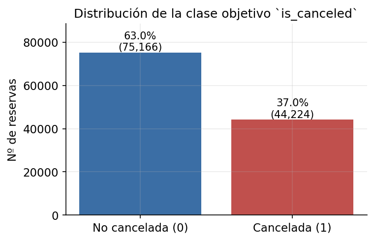
*Reparto de la clase objetivo. El desbalance (~37/63) motiva la estratificación y el uso de ROC-AUC.*

### 2.2. Columnas que "hacen trampa" (fuga de información)

La **fuga de información** (*data leakage*) ocurre cuando el modelo usa, sin querer, datos
que revelan la respuesta o que no existirían en el momento de predecir.

`reservation_status` vale `Canceled`/`No-Show` *exactamente* cuando `is_canceled = 1`, y
junto con `reservation_status_date` describe lo que ocurrió *después* de decidir la
cancelación. *Decisión:* eliminar ambas columnas; de lo contrario el modelo "vería la
respuesta" y obtendría un acierto del ~100 % engañoso e inútil.

Más sutil es `required_car_parking_spaces`: ninguna reserva con plaza de parking se cancela
(0 %), pero esa relación es *determinista* precisamente porque el dato **solo se conoce en
el *check-in***, cuando el cliente ya se ha presentado y, por tanto, no ha cancelado. El
0 % se mantiene incluso restringiendo a las reservas cancelables (`deposit_type = No
Deposit`), lo que descarta que sea una mera correlación con el depósito. *Decisión:*
**eliminarla** del modelo: en el momento de puntuar una reserva futura ese valor no existe.
Era la principal causa del optimismo de versiones anteriores.

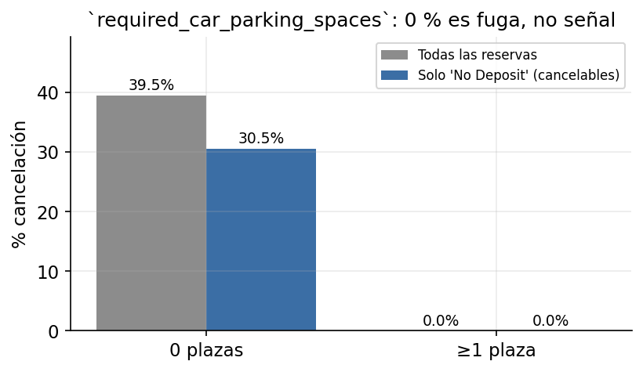
*`required_car_parking_spaces`: el 0 % de cancelación con plaza asignada persiste dentro de las reservas cancelables, revelando una fuga de check-in, no un predictor.*

La misma lógica descarta `assigned_room_type`, el tipo de habitación **finalmente
asignado**: solo se conoce en el *check-in*. Cuando la habitación asignada **difiere** de la
reservada la cancelación cae al 5.4 % (frente al 41.6 % cuando coinciden), porque reasignar
habitación implica que el cliente se presentó. Se elimina; `reserved_room_type` —la que el
cliente elige al reservar— sí se conserva.

También se descarta `arrival_date_year`: apenas discrimina (la tasa es casi idéntica los
tres años), no generaliza a años futuros no vistos y va confundido con la estación
(correlación −0.54 con la semana del año, porque el dataset cubre años parciales). La señal
estacional ya la recogen `arrival_date_month` y `week_number`, que sí se repiten cada año.

### 2.3. Valores ausentes

Cuatro columnas presentan huecos. En lugar de descartarlas, se tratan según su naturaleza:
`company` (~94 % vacía) y `agent` se conservan como categorías (el hueco pasa a una
etiqueta propia), `country` se imputa con una constante y `children` con 0. La imputación
se aprende *solo en entrenamiento* para no filtrar información del test.

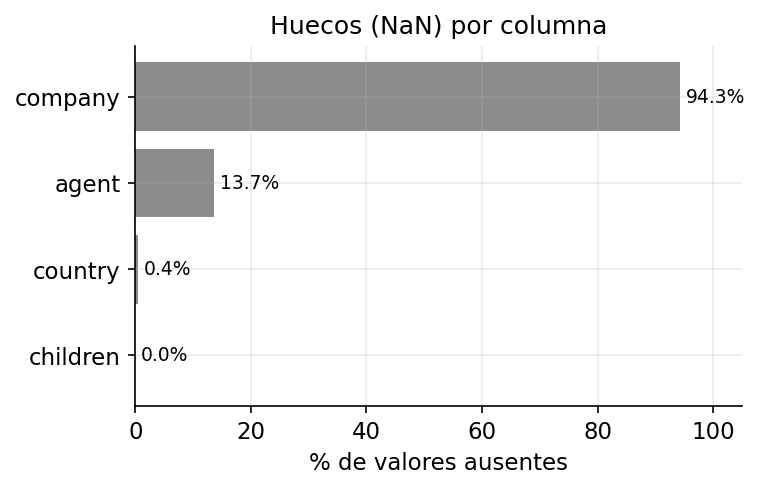
*Porcentaje de valores ausentes por columna. `company` está casi totalmente vacía, pero su ausencia es informativa.*

### 2.4. La ausencia es señal, no ruido

Que una reserva no tenga `company` o `agent` asignado no es un simple hueco: es una señal
con valor predictivo. Las reservas **con** empresa cancelan mucho menos que las que no la
tienen; con `agent` la señal va en sentido contrario. *Decisión:* derivar dos indicadores
binarios `has_company` y `has_agent` que capturan explícitamente esa diferencia, en vez de
descartar las columnas.

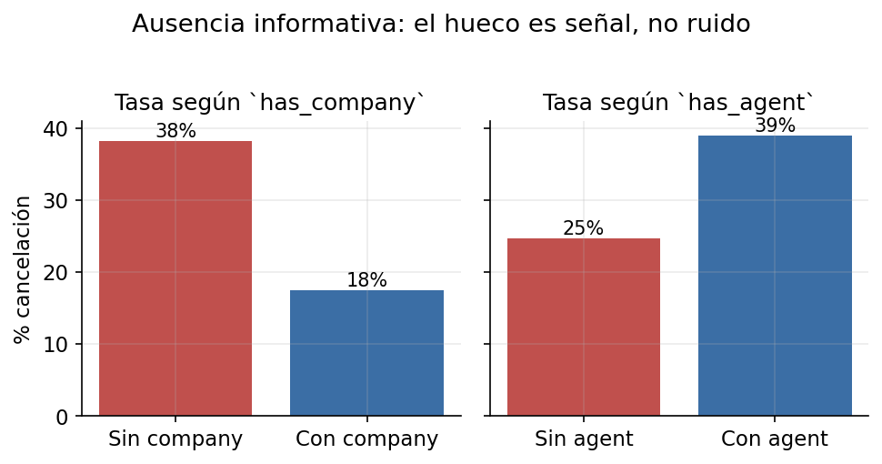
*Tasa de cancelación según la presencia/ausencia de `company` y `agent`. La ausencia discrimina, lo que justifica las variables derivadas `has_company`/`has_agent`.*

### 2.5. Variables numéricas

`lead_time` (días de antelación) es la numérica más relacionada con la cancelación: a más
antelación, mayor probabilidad de cancelar, de forma casi monótona por tramos.
`total_of_special_requests` se relaciona a la inversa (clientes más comprometidos cancelan
menos). Como las variables conviven en escalas muy distintas, se aplica
**estandarización** (media 0, desviación 1) para que ningún rango domine artificialmente.

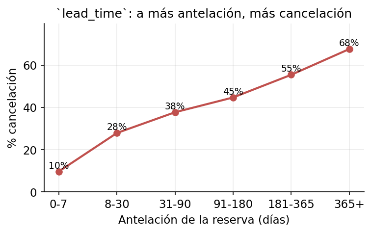
*Tasa de cancelación por tramos de `lead_time`: relación creciente y casi monótona, la señal numérica más fuerte.*

### 2.6. Variables categóricas y codificación

`deposit_type = Non Refund` (depósito no reembolsable) tiene una tasa de cancelación
**cercana al 99 %**: la variable más predictiva del conjunto. Las categóricas se
transforman a números mediante codificación **one-hot** (`OneHotEncoder`), una columna
binaria por categoría.

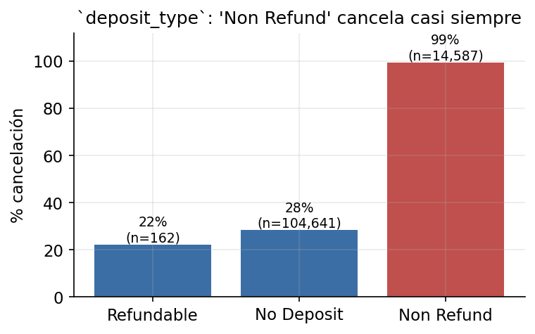
*`deposit_type`: el depósito no reembolsable casi garantiza la cancelación. Señal categórica dominante.*

El problema es que `country` (177 países), `agent` (333 agencias) y `company` (352) tienen
**altísima cardinalidad**: un *one-hot* directo crearía cientos de columnas casi vacías,
disparando la dimensionalidad y el sobreajuste. *Decisión:* aplicar una **reducción
supervisada de cardinalidad** *antes* del *one-hot*, implementada como un **transformador
propio** (`RareCategoryGrouper`, ya que scikit-learn no incluye ninguno que agrupe
categorías según el *target*). Se conservan las categorías con soporte suficiente
(`n ≥ 100`) y tasa de cancelación **extrema en cualquiera de los dos sentidos** (muy alta o
muy baja, con umbral adaptativo por variable: > 0.6 o < 0.3 de la tasa máxima de esa
columna); el resto se agrupa en `Otros`. La selección usa el objetivo, así que se aprende
**solo con el *train*** y se reaplica idéntica en test e inferencia (sin fuga). Lo
verificamos entrenando los 5 modelos con y sin la reducción: pasamos de **902 a 144
columnas** sin coste para **XGBoost** (ROC-AUC 0.9529 vs. 0.9573, dentro del ruido) y con
mejora para **Random Forest** (0.9363 vs. 0.9221). Así se preserva la señal de las
categorías relevantes sin pagar el coste dimensional.

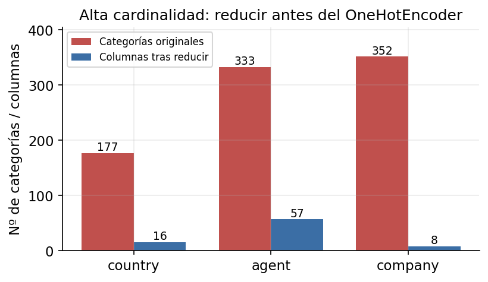
*Reducción supervisada de cardinalidad: de cientos de categorías a unas pocas columnas con señal, paso previo al `OneHotEncoder`.*

Por último, se sanea el conjunto eliminando registros claramente erróneos: ~180 reservas
sin ningún huésped (`adults + children + babies = 0`) y dos *outliers* flagrantes en la
tarifa diaria `adr` —un valor **negativo** (−6.4) y otro **desorbitado** (5400)— que solo
pueden ser errores de captura.

---

## 3. Diseño del sistema

El sistema no se construyó de una vez, sino siguiendo un **arco de desarrollo** en tres
etapas que va de la exploración libre a un servicio en producción. La progresión es
deliberada: cada etapa valida sus decisiones antes de comprometerlas en la siguiente.

### 3.1. Etapa 1 — Exploración con cuadernos

La fase exploratoria se realizó en *notebooks* autónomos, donde se analizaron los datos y
se prototiparon a mano las reglas de preparación y los primeros modelos. Es el terreno para
equivocarse barato: probar codificaciones, detectar y descartar variables con fuga, medir
el efecto del balanceo de clases, etc. De aquí salieron ya validadas todas las decisiones
del EDA de la sección anterior.

### 3.2. Etapa 2 — Generalización en un *pipeline*

Lo aprendido se consolidó en un *pipeline* de preprocesado reproducible que encadena, como
pasos sucesivos, la derivación de variables informativas (entre ellas
`has_company`/`has_agent`), la reducción supervisada de cardinalidad de las categóricas, la
imputación de huecos, la estandarización de las numéricas y la codificación *one-hot*. La
clave metodológica es que el preprocesado se **ajusta únicamente con los datos de
entrenamiento** y se guarda *junto al modelo*: así se evita cualquier fuga hacia el conjunto
de prueba y se garantiza que la inferencia replica exactamente el entrenamiento. Sobre ese
preprocesado común se entrenan y comparan, en igualdad de condiciones, **cinco familias de
modelos** —regresión logística (línea base), árbol de decisión, Random Forest, XGBoost y una
red neuronal multicapa con **Keras/TensorFlow** (densas 64→32→16 con *dropout* y salida
sigmoide)—, con sus hiperparámetros optimizados por validación cruzada. TensorFlow solo se
usa al entrenar la red; en producción se sirve XGBoost.

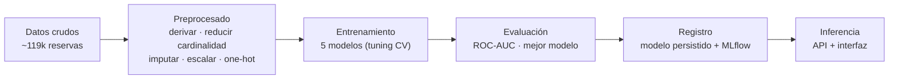

*El *pipeline* de extremo a extremo. El preprocesado se aprende del entrenamiento y se
persiste junto al modelo, de modo que predecir reproduce exactamente las transformaciones
del entrenamiento.*

### 3.3. Etapa 3 — Productivización

Finalmente, el modelo ganador se lleva a producción. El artefacto se persiste y se
**versiona en un registro de modelos** (MLflow), el código y el modelo viven en un
repositorio Git, y dos servicios desplegados de forma continua exponen el sistema al
usuario: una **API REST** (FastAPI) que sirve las predicciones y una **interfaz web**
(Streamlit) que permite explorar los resultados y predecir reservas concretas consumiendo
esa API. La arquitectura se organiza en cuatro planos —experimentación, trazabilidad,
repositorio y servicio— que pueden evolucionar de forma independiente: una nueva iteración
de modelado solo afecta a los dos primeros, y un cambio de interfaz, solo al último.

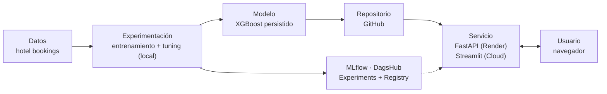

*Arquitectura en cuatro planos. El dato alimenta la experimentación local, que emite un
modelo versionado (MLflow/DagsHub) y un artefacto en el repositorio; de ahí, el despliegue
continuo publica la API y la interfaz que consume el usuario.*

### 3.4. Interpretabilidad

Un sistema que decide sobre el negocio debe poder **explicar** sus decisiones, no solo
acertar. Por eso el diseño incorpora interpretabilidad con **SHAP**, una técnica que reparte
cada predicción entre las variables, indicando cuánto empuja cada una hacia "cancela" o "no
cancela", a nivel **global** (qué pesa en general) y **local** (por qué *esa* reserva
concreta).

**A nivel global.** El resumen SHAP lo encabeza `deposit_type = Non Refund`, seguido del
segmento de mercado, las cancelaciones previas, el país (Portugal) y `has_company`. Que esta
última variable derivada aparezca tan arriba **valida la hipótesis de la ausencia
informativa** del EDA. La importancia interna del Random Forest ordena las variables de
forma muy parecida: que dos familias de modelos distintas coincidan en lo que importa
refuerza que el sistema aprende patrones reales, no artefactos de un algoritmo concreto.

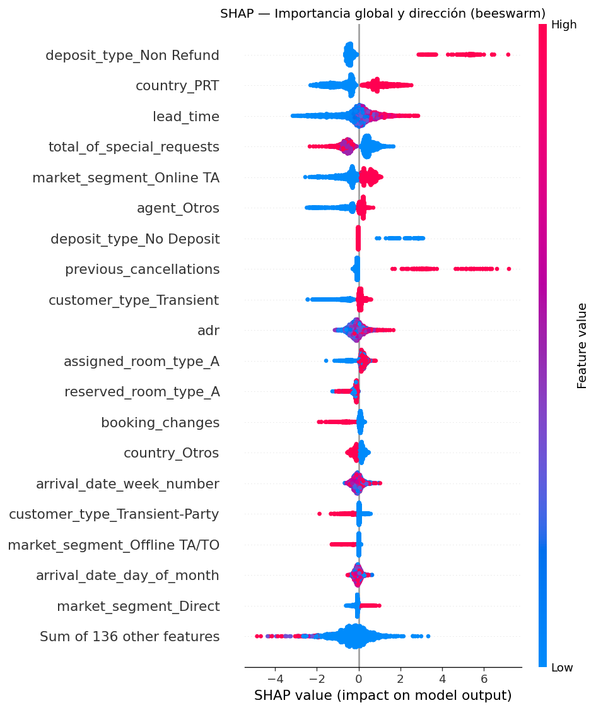
*Resumen SHAP global (beeswarm) del modelo ganador: aporte de cada variable a la predicción. Confirma los hallazgos del EDA.*

*Importancia de variables del Random Forest. Coincide en lo esencial con el ranking SHAP del ganador (depósito, `lead_time`, país, cancelaciones previas…), una validación cruzada entre familias de modelos.*

**A nivel local.** SHAP también explica reservas individuales. El siguiente *waterfall*
desglosa una reserva de **altísimo riesgo** (*p* ≈ 1): partiendo del riesgo medio, el
depósito no reembolsable (+3.2) y las cancelaciones previas (+2.8) la empujan con fuerza
hacia "cancela", y la elevada antelación añade más riesgo, mientras que pocos factores
tiran en sentido contrario. Este tipo de explicación es lo que permite **justificar al
negocio** por qué una reserva concreta se marca como dudosa.

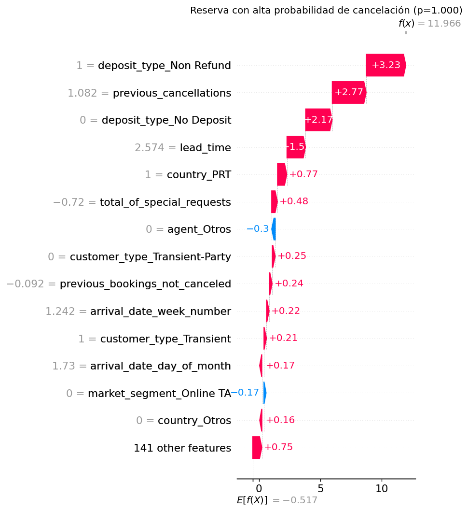
*Explicación local (waterfall SHAP) de una reserva de ejemplo con alta probabilidad de cancelación: contribución de cada variable a su predicción.*

---

## 4. Resultados y elección final

La evaluación se realiza sobre un **conjunto de prueba** de 23 713 reservas (20 % del
total) que el modelo no usó al entrenar. Las cifras corresponden a los hiperparámetros ya
optimizados.

### 4.1. La métrica: ROC-AUC

La métrica principal es el **ROC-AUC** (área bajo la curva ROC). En vez de medir cuántas
predicciones acierta con un umbral fijo, evalúa la capacidad del modelo de **ordenar** las
reservas por riesgo: equivale a la probabilidad de que, tomadas al azar una reserva
cancelada y otra no, el modelo asigne mayor riesgo a la cancelada. Vale 0.5 si no distingue
mejor que el azar y 1 si las ordena perfectamente. Se eligió por tres razones alineadas con
el caso de uso:

- **Robusta al desbalance:** a diferencia de la *accuracy*, no se deja engañar por la clase
  mayoritaria (un modelo que dijera "nadie cancela" acertaría el 63 % pero sería inútil).
- **Independiente del umbral:** no fija de antemano a partir de qué probabilidad se
  considera "cancelará", de modo que el hotel puede mover ese punto de corte según su coste
  —más agresivo para llenar plazas, más prudente si una falsa alarma es cara.
- **Comparable:** da una cifra única y homogénea para ordenar los cinco modelos.

Como el valor de negocio está precisamente en *priorizar* reservas por riesgo (para
*overbooking*, depósitos o retención), una métrica de **ordenación** es la más adecuada. Se
reportan además *recall* y precisión por su lectura directa para el negocio.

| Modelo | Acc. | Prec. | Rec. | F1 | **ROC-AUC** |
|---|:--:|:--:|:--:|:--:|:--:|
| **XGBoost** | 0.881 | 0.859 | 0.814 | 0.836 | **0.9529** |
| Red neuronal (Keras) | 0.861 | 0.845 | 0.769 | 0.805 | 0.9353 |
| Random Forest | 0.856 | 0.872 | 0.720 | 0.789 | 0.9338 |
| Árbol de decisión | 0.846 | 0.822 | 0.747 | 0.783 | 0.9235 |
| Regresión logística | 0.803 | 0.723 | 0.764 | 0.743 | 0.8862 |

*Métricas sobre el conjunto de prueba. XGBoost domina en la métrica principal (ROC-AUC) y en F1.*

### 4.2. El modelo ganador

**Se elige XGBoost** (ROC-AUC = 0.9529). Supera al resto en la métrica principal y en F1, y
aun así entrena en pocos segundos. En términos de negocio, con el umbral por defecto detecta
el **81 % de las cancelaciones reales** (*recall* 0.81) con una **precisión del 86 %**: un
buen equilibrio para actuar sin generar demasiadas falsas alarmas. El Random Forest es el
más conservador (más precisión, menos *recall*), preferible si una falsa alarma fuese muy
costosa. Las curvas ROC confirman esta jerarquía.

La matriz de confusión del ganador desglosa su comportamiento sobre las 23 713 reservas de
prueba: detecta **7193** de las 8835 cancelaciones reales y se le escapan 1642 (los falsos
negativos), generando solo **1178** falsas alarmas sobre las reservas que no se cancelaban.

*Curvas ROC comparativas. Cuanto más cerca de la esquina superior izquierda, mejor; XGBoost domina al resto.*

*Matriz de confusión del modelo ganador (XGBoost) sobre el conjunto de prueba: los aciertos están en la diagonal.*

**Nota de honestidad.** Una versión previa reportaba ROC-AUC 0.9614, pero incluía dos fugas
de *check-in* (sección 2): `required_car_parking_spaces` y `assigned_room_type`. Al eliminar
ambas, la cifra *honesta* baja a 0.9529. Las variables derivadas
`has_company`/`has_agent` y la reducción de cardinalidad recuperan la mayor parte de la
señal perdida.

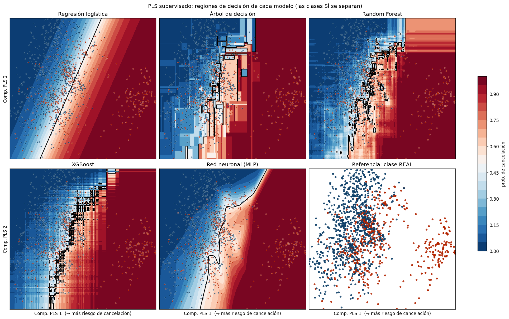
*Regiones de decisión de los cinco modelos sobre una proyección 2D supervisada (PLS). Permite comparar visualmente la frontera que aprende cada familia de algoritmos sobre el mismo plano.*

---

## 5. Reflexión crítica: limitaciones y mejoras

Ser honestos con las limitaciones forma parte de un buen trabajo de ML.

**Limitaciones actuales.**

- **Validación temporal pendiente:** la partición es aleatoria. Como las reservas tienen
  fecha (2015–2017), una división *por tiempo* (entrenar con el pasado, probar con el
  futuro) sería más realista y probablemente daría una cifra algo más baja, pero más fiable.
- **Desbalance sin tratamiento explícito:** se aborda con estratificación y una métrica
  adecuada, no con técnicas de reequilibrado. El balanceo (`class_weight`, SMOTE) se exploró
  y sube el *recall* a costa de precisión, pero deja el ROC-AUC casi igual, por lo que no se
  incorpora al *pipeline* de producción.
- **Cardinalidad simplificada:** agrupar las categorías raras en `Otros` sacrifica parte de
  su información individual.
- **Umbral fijo en 0.5:** no se ha ajustado a un objetivo de negocio concreto.

**Líneas de mejora.**

- **Un modelo por hotel.** El EDA mostró que el *City Hotel* y el *Resort Hotel* se
  comportan casi como dos negocios distintos, con estacionalidad y tasa de cancelación
  diferentes. Entrenar un modelo especializado para cada uno, en lugar de uno único, podría
  capturar mejor sus patrones propios, a costa de mantener y servir dos modelos.
- **Validación temporal** para cifras más fiables que la partición aleatoria.
- **Calibración de probabilidades** y ajuste del umbral según el coste de una cancelación no
  detectada frente a una falsa alarma.
- ***Embeddings*** para las categóricas de alta cardinalidad (`country`, `agent`), que
  preservarían más señal que el agrupamiento.
- **Infraestructura con más memoria** (p. ej. Hugging Face Spaces) para reactivar la carga
  del modelo desde el *Model Registry* de MLflow en el despliegue público, hoy limitado por
  la RAM del *tier* gratuito.

---

*Reproducibilidad.* Los resultados se generan con
`python -m ml_hotel_cancellations.ml.train` (Python 3.12) y las figuras del EDA con
`python memoria/generar_figuras_eda.py`; el resto provienen de `outputs/`.
