# Predicción de cancelaciones de reservas hoteleras

**Memoria del Proyecto Final de Módulo**
Máster en IA, Cloud Computing y DevOps · Módulo de Machine Learning y Deep Learning

> 📄 Esta memoria existe también en **PDF** (`memoria/memoria.pdf`, formato académico a
> dos columnas); se compila con `make memo`. Los términos técnicos están explicados en
> el [**glosario**](glosario.md).

**Resumen.** Las cancelaciones tardías de reservas vacían habitaciones difíciles de
revender y distorsionan la previsión de ocupación del hotel. Este trabajo aborda la
predicción de la cancelación de una reserva (`is_canceled`) como un problema de
**clasificación binaria** sobre ~119 000 reservas y 31 características. Partiendo de un
análisis exploratorio que detecta y corrige varias fugas de información, se diseña un
_pipeline_ de preprocesado reproducible (derivación de variables, reducción supervisada
de cardinalidad, imputación, estandarización y codificación _one-hot_) y se comparan
cinco familias de modelos. El ganador, **XGBoost**, alcanza un **ROC-AUC de 0.9529**
sobre un conjunto de prueba independiente. El modelo se sirve mediante una API REST
(FastAPI) y se muestra en una interfaz web (Streamlit) que predice e interpreta cada
reserva con SHAP.

**Autores.**
Manuel Pérez Martínez (manugijon@gmail.com) · Joaquín Castro Salas (jcastrosalas03@gmail.com)
Repositorio: https://github.com/manupm87/pontia-ml

**Roles y reparto del trabajo.** El proyecto se ha desarrollado de forma plenamente
colaborativa: ambos integrantes participaron en **todas las fases** del trabajo —análisis
exploratorio, diseño del _pipeline_, entrenamiento y comparación de modelos, productivización
(API y UI) y documentación—. El método de trabajo fue principalmente el _pair programming_:
las decisiones técnicas se tomaron y se pusieron en común de forma conjunta en sesiones
compartidas, de modo que ambos asumen por igual la responsabilidad sobre el conjunto del
sistema.

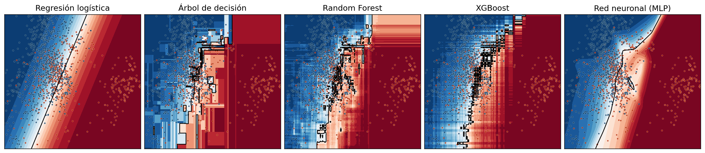
_Regiones de decisión aprendidas por los cinco modelos sobre el mismo plano 2D supervisado
(PLS): el color es la probabilidad estimada de cancelación (azul→rojo) y los puntos,
reservas reales del conjunto de prueba. Anticipa visualmente la comparativa de la Sección 4._

---

## 1. Justificación del problema

Las **cancelaciones de reservas** son uno de los principales problemas económicos del
sector hotelero. Una cancelación, sobre todo si llega con poca antelación, deja una
habitación vacía que rara vez vuelve a venderse: se pierde el ingreso de esa noche y, con
él, parte del margen del establecimiento. El daño va más allá del ingreso directo, porque
las cancelaciones **distorsionan la previsión de ocupación** sobre la que se planifican el
personal, los aprovisionamientos y los precios, complicando la gestión diaria del hotel.

Para defenderse, los hoteles recurren a prácticas como el _overbooking_ (aceptar más
reservas que plazas contando con que algunas se cancelarán), la exigencia de depósitos o
las campañas de retención. Todas comparten un requisito: solo son seguras y rentables si
el hotel puede **anticipar qué reservas tienen más riesgo** de cancelarse. Una estimación
fiable de ese riesgo permite actuar de forma selectiva —sobrevender en la medida justa,
pedir garantías a las reservas dudosas o intervenir antes de que el cliente cancele— y
proteger así los ingresos y la calidad del servicio.

Anticipar las cancelaciones es, por tanto, un problema con un retorno claro y directo para
el negocio, lo que justifica el esfuerzo de construir un sistema que las prediga.

Formalmente, representamos la cancelación como una variable aleatoria binaria
$Y \in \{0,1\}$ ($Y=1$ si la reserva se cancela). El sistema estima la probabilidad
condicionada $\hat{p}(\mathbf{x}) = P(Y=1 \mid \mathbf{x})$ a partir del vector de
características $\mathbf{x} \in \mathbb{R}^{D}$, y la decisión final aplica un umbral $\tau$:

$$\hat{Y} = \begin{cases} 1 & \text{si } \hat{p}(\mathbf{x}) \geq \tau \\ 0 & \text{si } \hat{p}(\mathbf{x}) < \tau \end{cases}$$

donde $\tau$ puede ajustarse según la matriz de costes del hotel, ponderando el coste de un
falso negativo (habitación vacía) frente al de un falso positivo (compensación por
_overbooking_).

---

## 2. Análisis exploratorio de datos

El EDA es la fase en la que exploramos los datos con tablas y gráficos _antes de modelar_,
para tomar decisiones con fundamento. Cada hallazgo de esta sección se tradujo en una
decisión de diseño concreta del _pipeline_.

### 2.1. La clase objetivo está desbalanceada

Alrededor del **37 %** de las reservas se cancelan frente a un 63 % que no. Es un
desbalance moderado. _Decisión:_ usar una **partición estratificada** (preservar ese 37 %
en entrenamiento y prueba) y elegir el **ROC-AUC** como métrica principal en lugar de la
_accuracy_, que premiaría a un clasificador trivial.

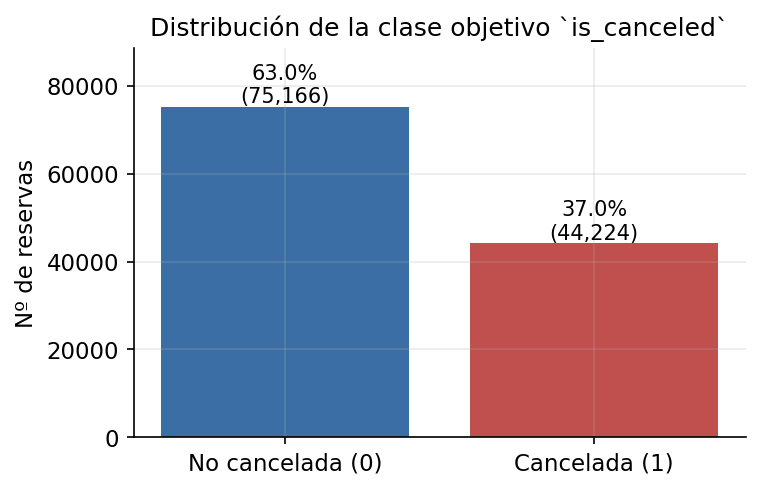
_Reparto de la clase objetivo. El desbalance (~37/63) motiva la estratificación y el uso de ROC-AUC._

### 2.2. Columnas que "hacen trampa" (fuga de información)

La **fuga de información** (_data leakage_) ocurre cuando el modelo usa, sin querer, datos
que revelan la respuesta o que no existirían en el momento de predecir.

`reservation_status` vale `Canceled`/`No-Show` _exactamente_ cuando `is_canceled = 1`, y
junto con `reservation_status_date` describe lo que ocurrió _después_ de decidir la
cancelación. _Decisión:_ eliminar ambas columnas; de lo contrario el modelo "vería la
respuesta" y obtendría un acierto del ~100 % engañoso e inútil.

Más sutil es `required_car_parking_spaces`: ninguna reserva con plaza de parking se cancela
(0 %), pero esa relación es _determinista_ precisamente porque el dato **solo se conoce en
el _check-in_**, cuando el cliente ya se ha presentado y, por tanto, no ha cancelado. El
0 % se mantiene incluso restringiendo a las reservas cancelables (`deposit_type = No
Deposit`), lo que descarta que sea una mera correlación con el depósito. _Decisión:_
**eliminarla** del modelo: en el momento de puntuar una reserva futura ese valor no existe.
Era la principal causa del optimismo de versiones anteriores.

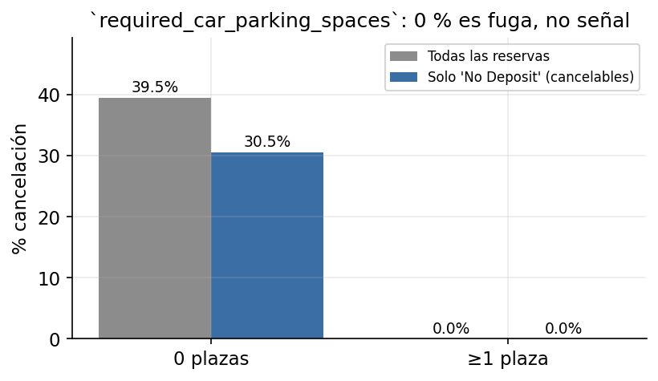
_`required_car_parking_spaces`: el 0 % de cancelación con plaza asignada persiste dentro de las reservas cancelables, revelando una fuga de check-in, no un predictor._

La misma lógica descarta `assigned_room_type`, el tipo de habitación **finalmente
asignado**: solo se conoce en el _check-in_. Cuando la habitación asignada **difiere** de la
reservada la cancelación cae al 5.4 % (frente al 41.6 % cuando coinciden), porque reasignar
habitación implica que el cliente se presentó. Se elimina; `reserved_room_type` —la que el
cliente elige al reservar— sí se conserva.

También se descarta `arrival_date_year`: apenas discrimina (la tasa es casi idéntica los
tres años), no generaliza a años futuros no vistos y va confundido con la estación
(correlación −0.54 con la semana del año, porque el dataset cubre años parciales). La señal
estacional ya la recogen `arrival_date_month` y `week_number`, que sí se repiten cada año.

### 2.3. Valores ausentes

Cuatro columnas presentan huecos. En lugar de descartarlas, se tratan según su naturaleza:
`company` (~94 % vacía) y `agent` se conservan como categorías (el hueco pasa a una
etiqueta propia), `country` se imputa con una constante y `children` con 0. La imputación
se aprende _solo en entrenamiento_ para no filtrar información del test.

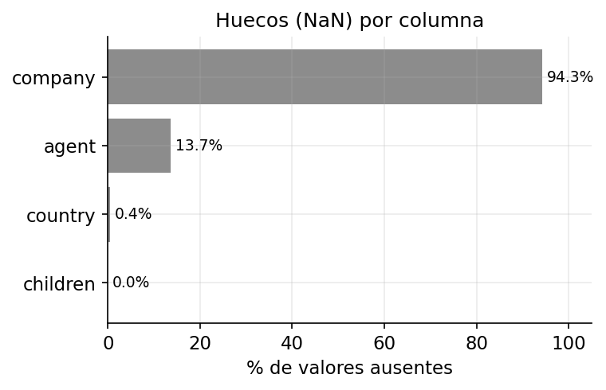
_Porcentaje de valores ausentes por columna. `company` está casi totalmente vacía, pero su ausencia es informativa._

### 2.4. La ausencia es señal, no ruido

Que una reserva no tenga `company` o `agent` asignado no es un simple hueco: es una señal
con valor predictivo. Las reservas **con** empresa cancelan mucho menos que las que no la
tienen; con `agent` la señal va en sentido contrario. _Decisión:_ derivar dos indicadores
binarios `has_company` y `has_agent` que capturan explícitamente esa diferencia, en vez de
descartar las columnas.

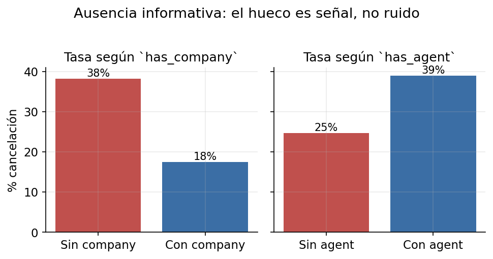
_Tasa de cancelación según la presencia/ausencia de `company` y `agent`. La ausencia discrimina, lo que justifica las variables derivadas `has_company`/`has_agent`._

### 2.5. Variables numéricas

`lead_time` (días de antelación) es la numérica más relacionada con la cancelación: a más
antelación, mayor probabilidad de cancelar, de forma casi monótona por tramos.
`total_of_special_requests` se relaciona a la inversa (clientes más comprometidos cancelan
menos). Como las variables conviven en escalas muy distintas, se aplica
**estandarización** (media 0, desviación 1) para que ningún rango domine artificialmente.
Esta transformación **no perjudica a ningún modelo**: los basados en árboles (Random Forest
y XGBoost, el ganador) son insensibles a la escala —deciden por cortes y el orden de los
valores no cambia—, mientras que la regresión logística y la red neuronal sí se benefician
de ella (convergen mejor y sus coeficientes son comparables). Por eso, aunque
matemáticamente algunas variables no la necesiten, la aplicamos de forma **global**:
simplifica el _pipeline_ y no introduce ningún efecto negativo.

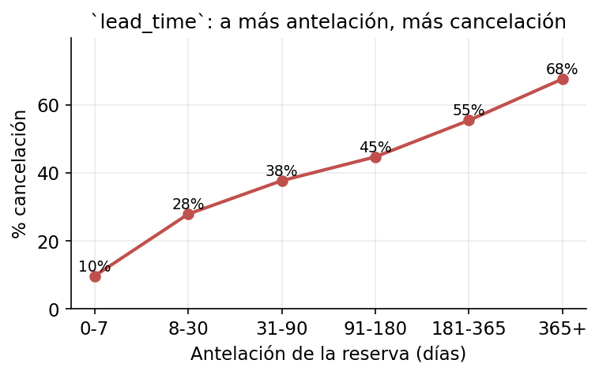
_Tasa de cancelación por tramos de `lead_time`: relación creciente y casi monótona, la señal numérica más fuerte._

### 2.6. Variables categóricas y codificación

`deposit_type = Non Refund` (depósito no reembolsable) tiene una tasa de cancelación
**cercana al 99 %**: la variable más predictiva del conjunto. Las categóricas se
transforman a números mediante codificación **one-hot** (`OneHotEncoder`), una columna
binaria por categoría.

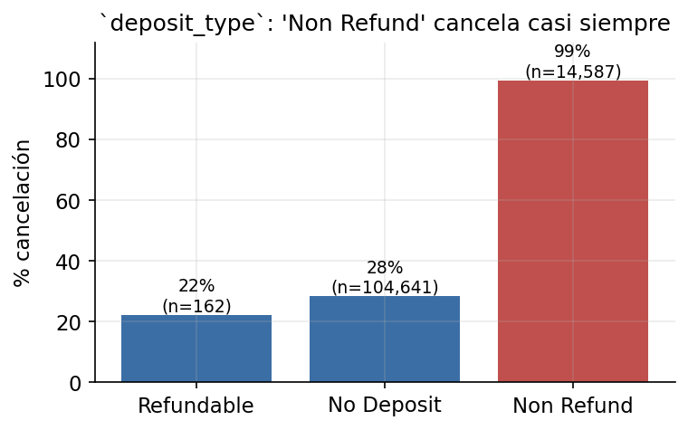
_`deposit_type`: el depósito no reembolsable casi garantiza la cancelación. Señal categórica dominante._

El problema es que `country` (177 países), `agent` (333 agencias) y `company` (352) tienen
**altísima cardinalidad**: un _one-hot_ directo crearía cientos de columnas casi vacías,
disparando la dimensionalidad y el sobreajuste. _Decisión:_ aplicar una **reducción
supervisada de cardinalidad** _antes_ del _one-hot_, implementada como un **transformador
propio** (`RareCategoryGrouper`, ya que scikit-learn no incluye ninguno que agrupe
categorías según el _target_). Se conservan las categorías con soporte suficiente
(`n ≥ 100`) y tasa de cancelación **extrema en cualquiera de los dos sentidos** (muy alta o
muy baja, con umbral adaptativo por variable: > 0.6 o < 0.3 de la tasa máxima de esa
columna); el resto se agrupa en `Otros`. La selección usa el objetivo, así que se aprende
**solo con el _train_** y se reaplica idéntica en test e inferencia (sin fuga). Lo
verificamos entrenando los 5 modelos con y sin la reducción: pasamos de **902 a 144
columnas** sin coste para **XGBoost** (ROC-AUC 0.9529 vs. 0.9573, dentro del ruido) y con
mejora para **Random Forest** (0.9363 vs. 0.9221). Así se preserva la señal de las
categorías relevantes sin pagar el coste dimensional. Las siguientes figuras muestran
_qué_ categorías sobreviven en cada variable, ordenadas por tasa de cancelación: en rojo
las de **alto riesgo** (tasa > 0.6 del máximo de la columna) y en azul las **muy fiables**
(< 0.3 del máximo). El resto, sin señal extrema, se agrupa en `Otros`.

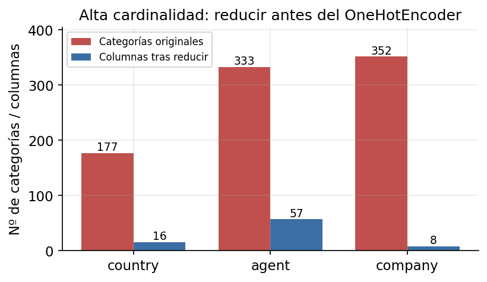
_Reducción supervisada de cardinalidad: de cientos de categorías a unas pocas columnas con señal, paso previo al `OneHotEncoder`._

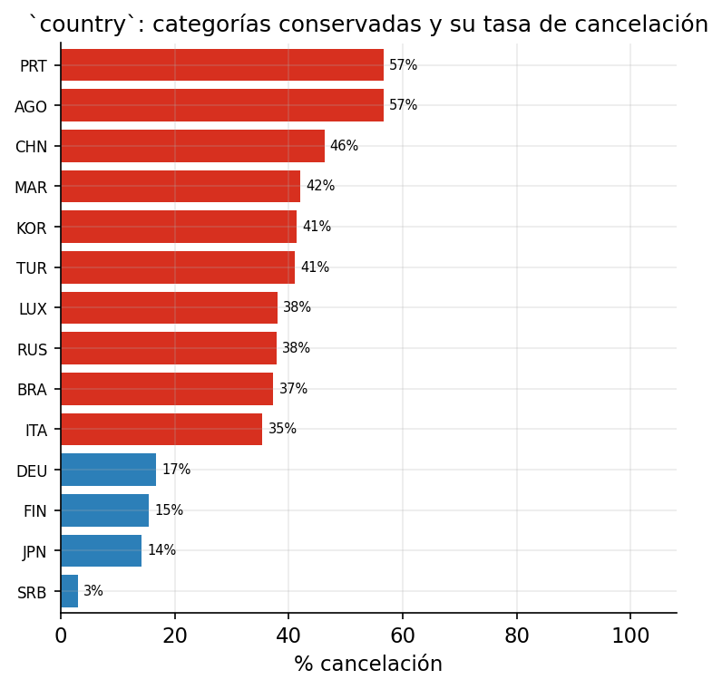
_`country`: las 14 categorías conservadas y su tasa de cancelación. Portugal y Angola encabezan el alto riesgo; Alemania, Finlandia o Japón son las más fiables._

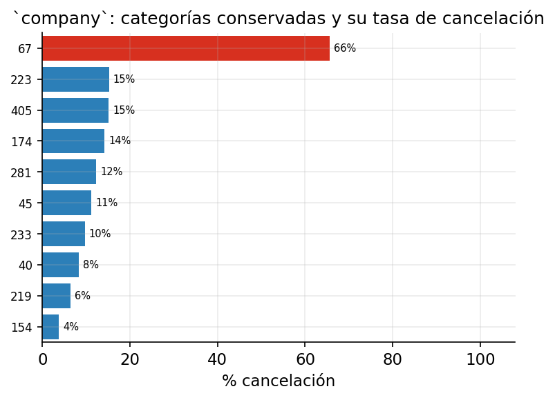
_`company`: las 10 empresas conservadas y su tasa de cancelación._

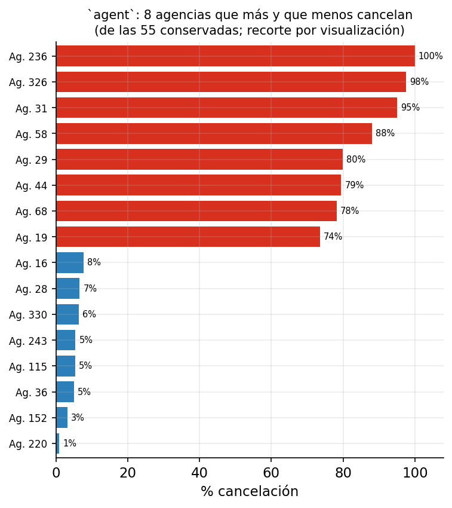
_`agent`: por legibilidad se muestran solo las 8 agencias que más cancelan (rojo, varias al 80–100 %) y las 8 que menos (azul), de las ~55 conservadas. Las intermedias, sin señal extrema, caen en `Otros`._

Por último, se sanea el conjunto eliminando registros claramente erróneos: ~180 reservas
sin ningún huésped (`adults + children + babies = 0`) y dos _outliers_ flagrantes en la
tarifa diaria `adr` —un valor **negativo** (−6.4) y otro **desorbitado** (5400)— que solo
pueden ser errores de captura.

---

## 3. Diseño del sistema

El sistema no se construyó de una vez, sino siguiendo un **arco de desarrollo** en tres
etapas que va de la exploración libre a un servicio en producción. La progresión es
deliberada: cada etapa valida sus decisiones antes de comprometerlas en la siguiente.

### 3.1. Etapa 1 — Exploración con cuadernos

La fase exploratoria se realizó en _notebooks_ autónomos, donde se analizaron los datos y
se prototiparon a mano las reglas de preparación y los primeros modelos. Es el terreno para
equivocarse barato: probar codificaciones, detectar y descartar variables con fuga, medir
el efecto del balanceo de clases, etc. De aquí salieron ya validadas todas las decisiones
del EDA de la sección anterior.

### 3.2. Etapa 2 — Generalización en un _pipeline_

Lo aprendido se consolidó en un _pipeline_ de preprocesado reproducible que encadena, como
pasos sucesivos, la derivación de variables informativas (entre ellas
`has_company`/`has_agent`), la reducción supervisada de cardinalidad de las categóricas, la
imputación de huecos, la estandarización de las numéricas y la codificación _one-hot_. La
clave metodológica es que el preprocesado se **ajusta únicamente con los datos de
entrenamiento** y se guarda _junto al modelo_: así se evita cualquier fuga hacia el conjunto
de prueba y se garantiza que la inferencia replica exactamente el entrenamiento. Sobre ese
preprocesado común se entrenan y comparan, en igualdad de condiciones, **cinco familias de
modelos** —regresión logística (línea base), árbol de decisión, Random Forest, XGBoost y una
red neuronal multicapa con **Keras/TensorFlow** (densas 64→32→16 con _dropout_ y salida
sigmoide)—, con sus hiperparámetros optimizados por validación cruzada.

**¿Qué es la validación cruzada?** En lugar de fiar la elección de hiperparámetros a una
única partición, la _validación cruzada_ (_k-fold_) divide el entrenamiento en _k_ bloques:
entrena con _k−1_ y mide en el bloque restante, rotando hasta que cada bloque ha servido una
vez de validación. El promedio de las _k_ medidas es una estimación **más estable y menos
optimista** del rendimiento, y evita ajustar los hiperparámetros al azar de un único
reparto. La configuración finalmente elegida es la que mejor puntúa en ese promedio.

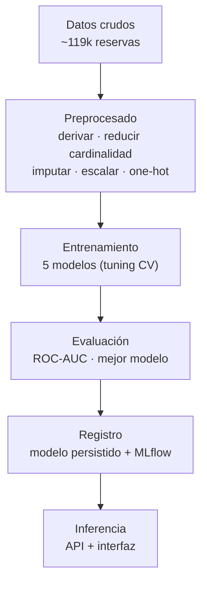
```mermaid
flowchart TD
    D["Datos crudos<br/>~119k reservas"] --> P["Preprocesado<br/>derivar · reducir cardinalidad<br/>imputar · escalar · one-hot"]
    P --> T["Entrenamiento<br/>5 modelos (tuning CV)"]
    T --> E["Evaluación<br/>ROC-AUC · mejor modelo"]
    E --> R["Registro<br/>modelo persistido + MLflow"]
    R --> I["Inferencia<br/>API + interfaz"]
```

*El *pipeline* de extremo a extremo. El preprocesado se aprende del entrenamiento y se
persiste junto al modelo, de modo que predecir reproduce exactamente las transformaciones
del entrenamiento.*

### 3.3. Etapa 3 — Productivización

Finalmente, el modelo ganador se lleva a producción. El artefacto se persiste y se
**versiona en un registro de modelos** (MLflow), el código y el modelo viven en un
repositorio Git, y dos servicios desplegados de forma continua exponen el sistema al
usuario: una **API REST** (FastAPI) que sirve las predicciones y una **interfaz web**
(Streamlit) que permite explorar los resultados y predecir reservas concretas consumiendo
esa API. La arquitectura se organiza en cuatro planos —experimentación, trazabilidad,
repositorio y servicio— que pueden evolucionar de forma independiente: una nueva iteración
de modelado solo afecta a los dos primeros, y un cambio de interfaz, solo al último.

**Despliegue público.** El sistema está accesible en línea (servicios en _tier_ gratuito;
pueden tardar unos segundos en activarse tras inactividad):

- **Interfaz web** (Streamlit): <https://ml-hotel-cancellations-manupm87.streamlit.app>
- **API REST** (FastAPI, Swagger): <https://pontia-api-fi8t.onrender.com/docs>
- **Experimentos y registro de modelos** (MLflow en DagsHub): <https://dagshub.com/manupm87/pontia-ml.mlflow>

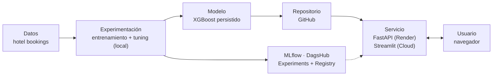
```mermaid
flowchart LR
    Datos["Datos<br/>hotel bookings"] --> Exp["Experimentación<br/>entrenamiento + tuning (local)"]
    Exp --> Modelo["Modelo<br/>XGBoost persistido"]
    Modelo --> Repo["Repositorio<br/>GitHub"]
    Repo --> Svc["Servicio<br/>FastAPI (Render)<br/>Streamlit (Cloud)"]
    Svc <--> User["Usuario<br/>navegador"]
    Exp --> MLflow["MLflow · DagsHub<br/>Experiments + Registry"]
    MLflow -.-> Svc
```

_Arquitectura en cuatro planos. El dato alimenta la experimentación local, que emite un
modelo versionado (MLflow/DagsHub) y un artefacto en el repositorio; de ahí, el despliegue
continuo publica la API y la interfaz que consume el usuario._

### 3.4. Interpretabilidad

Un sistema que decide sobre el negocio debe poder **explicar** sus decisiones, no solo
acertar. Por eso el diseño incorpora interpretabilidad con **SHAP**, una técnica que reparte
cada predicción entre las variables, indicando cuánto empuja cada una hacia "cancela" o "no
cancela", a nivel **global** (qué pesa en general) y **local** (por qué _esa_ reserva
concreta).

**A nivel global.** El resumen SHAP lo encabeza `deposit_type = Non Refund`, seguido del
país (Portugal, `country_PRT`), el `lead_time`, el total de peticiones especiales, el
segmento de mercado (`Online TA`) y las cancelaciones previas. Aparece también `agent_Otros`,
lo que confirma que el grupo de agencias condensado por la reducción de cardinalidad sí
aporta señal. La importancia interna del Random Forest ordena las variables de forma muy
parecida: que dos familias de modelos distintas coincidan en lo que importa refuerza que el
sistema aprende patrones reales, no artefactos de un algoritmo concreto.

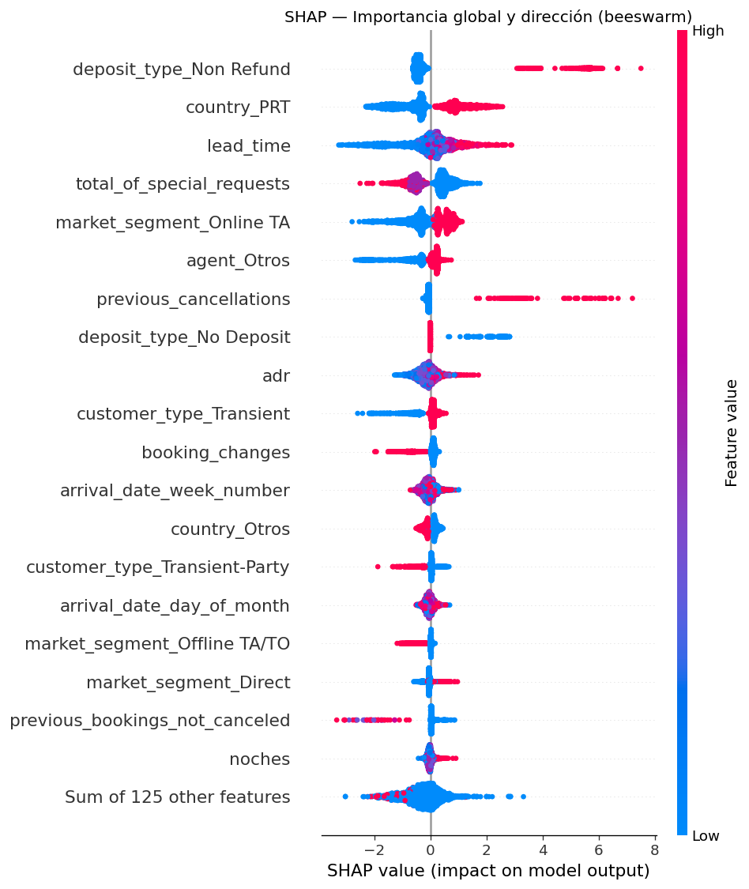
_Resumen SHAP global (beeswarm) del modelo ganador: aporte de cada variable a la predicción. Confirma los hallazgos del EDA._

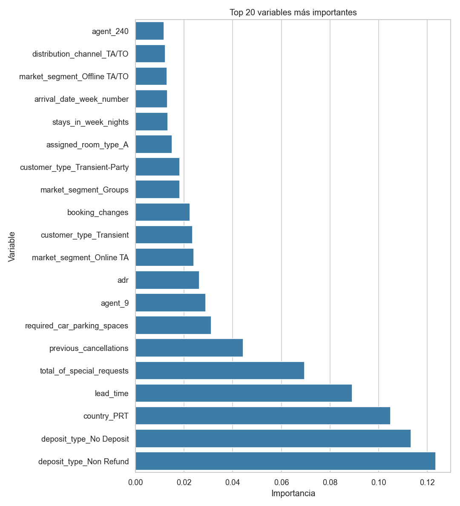
_Importancia de variables del Random Forest. Coincide en lo esencial con el ranking SHAP del ganador (depósito, `lead_time`, país, cancelaciones previas…), una validación cruzada entre familias de modelos._

**A nivel local.** SHAP también explica reservas individuales. El siguiente _waterfall_
desglosa una reserva de **altísimo riesgo** (_p_ ≈ 1): partiendo del riesgo medio, el
depósito no reembolsable (+3.45) y las cancelaciones previas (+2.87) la empujan con fuerza
hacia "cancela", mientras que solo unos pocos factores tiran ligeramente en sentido
contrario. Este tipo de explicación es lo que permite **justificar al negocio** por qué una
reserva concreta se marca como dudosa.

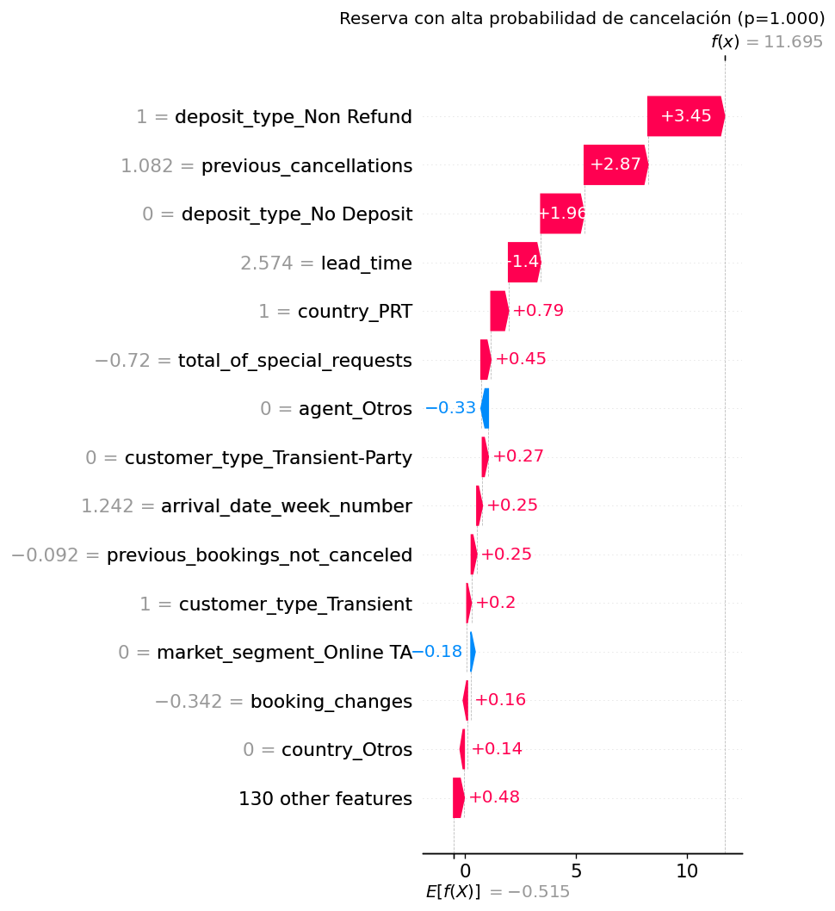
_Explicación local (waterfall SHAP) de una reserva de ejemplo con alta probabilidad de cancelación: contribución de cada variable a su predicción._

---

## 4. Resultados y elección final

La evaluación se realiza sobre un **conjunto de prueba** de 23 713 reservas (20 % del
total) que el modelo no usó al entrenar. Las cifras corresponden a los hiperparámetros ya
optimizados.

### 4.1. La métrica: ROC-AUC

La métrica principal es el **ROC-AUC** (área bajo la curva ROC). En vez de medir cuántas
predicciones acierta con un umbral fijo, evalúa la capacidad del modelo de **ordenar** las
reservas por riesgo: equivale a la probabilidad de que, tomadas al azar una reserva
cancelada y otra no, el modelo asigne mayor riesgo a la cancelada. Vale 0.5 si no distingue
mejor que el azar y 1 si las ordena perfectamente. Se eligió por tres razones alineadas con
el caso de uso:

- **Robusta al desbalance:** a diferencia de la _accuracy_, no se deja engañar por la clase
  mayoritaria (un modelo que dijera "nadie cancela" acertaría el 63 % pero sería inútil).
- **Independiente del umbral:** no fija de antemano a partir de qué probabilidad se
  considera "cancelará", de modo que el hotel puede mover ese punto de corte según su coste
  —más agresivo para llenar plazas, más prudente si una falsa alarma es cara.
- **Comparable:** da una cifra única y homogénea para ordenar los cinco modelos.

Como el valor de negocio está precisamente en _priorizar_ reservas por riesgo (para
_overbooking_, depósitos o retención), una métrica de **ordenación** es la más adecuada. Se
reportan además _recall_ y precisión por su lectura directa para el negocio.

Formalmente, el ROC-AUC es el área bajo la curva que enfrenta la tasa de verdaderos
positivos $\mathrm{TPR}(\tau)$ frente a la de falsos positivos $\mathrm{FPR}(\tau)$ al variar
el umbral, $\mathrm{AUC} = \int_0^1 \mathrm{TPR}\bigl(\mathrm{FPR}^{-1}(u)\bigr)\,du$, y
equivale al estadístico de Mann–Whitney [1]: si $X_1$ es el riesgo predicho para una reserva
cancelada al azar y $X_0$ el de una no cancelada,

$$\mathrm{AUC} = P(X_1 > X_0)$$

Es decir, mide directamente la probabilidad de ordenar correctamente un par
cancelada/no-cancelada, independientemente del umbral.

| Modelo               | Acc.  | Prec. | Rec.  |  F1   | **ROC-AUC** |
| -------------------- | :---: | :---: | :---: | :---: | :---------: |
| **XGBoost**          | 0.881 | 0.859 | 0.814 | 0.836 | **0.9529**  |
| Red neuronal (Keras) | 0.861 | 0.845 | 0.769 | 0.805 |   0.9353    |
| Random Forest        | 0.856 | 0.872 | 0.720 | 0.789 |   0.9338    |
| Árbol de decisión    | 0.846 | 0.822 | 0.747 | 0.783 |   0.9235    |
| Regresión logística  | 0.803 | 0.723 | 0.764 | 0.743 |   0.8862    |

_Métricas sobre el conjunto de prueba. XGBoost domina en la métrica principal (ROC-AUC) y en F1._

### 4.2. El modelo ganador

**Se elige XGBoost** (ROC-AUC = 0.9529). Supera al resto en la métrica principal y en F1, y
aun así entrena en pocos segundos. En términos de negocio, con el umbral por defecto detecta
el **81 % de las cancelaciones reales** (_recall_ 0.81) con una **precisión del 86 %**: un
buen equilibrio para actuar sin generar demasiadas falsas alarmas. El Random Forest es el
más conservador (más precisión, menos _recall_), preferible si una falsa alarma fuese muy
costosa. Las curvas ROC confirman esta jerarquía.

Su ventaja teórica está en cómo optimiza: en cada iteración $t$ aproxima la pérdida con una
expansión de Taylor de segundo orden y penaliza la complejidad del árbol, minimizando el
objetivo regularizado de Chen y Guestrin [2]:

$$\mathcal{L}^{(t)} \approx \sum_{i=1}^{n} \Bigl[ g_i\,f_t(\mathbf{x}_i) + \tfrac{1}{2} h_i\,f_t^{2}(\mathbf{x}_i) \Bigr] + \gamma T + \tfrac{1}{2}\lambda \sum_{j=1}^{T} w_j^{2}$$

donde $g_i$ y $h_i$ son los gradientes de primer y segundo orden de la pérdida en la
predicción previa, $T$ es el número de hojas, $w_j$ sus pesos y $\gamma,\lambda$
regularizadores. Esa penalización explícita de la complejidad explica su robustez y
eficiencia en CPU.

La matriz de confusión del ganador desglosa su comportamiento sobre las 23 713 reservas de
prueba: detecta **7193** de las 8835 cancelaciones reales y se le escapan 1642 (los falsos
negativos), generando solo **1178** falsas alarmas sobre las reservas que no se cancelaban.

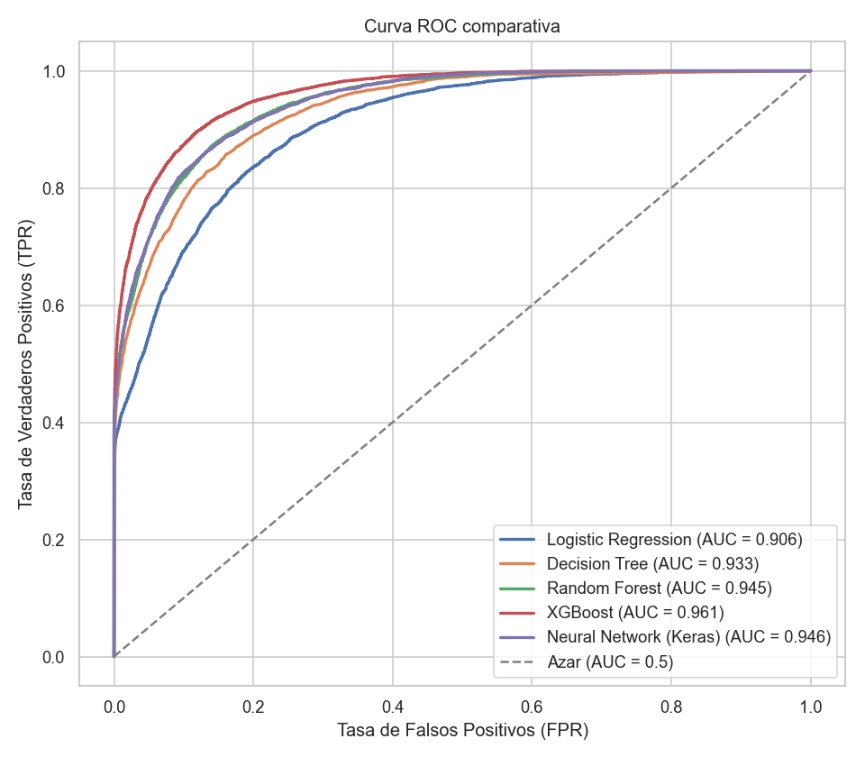
_Curvas ROC comparativas. Cuanto más cerca de la esquina superior izquierda, mejor; XGBoost domina al resto._

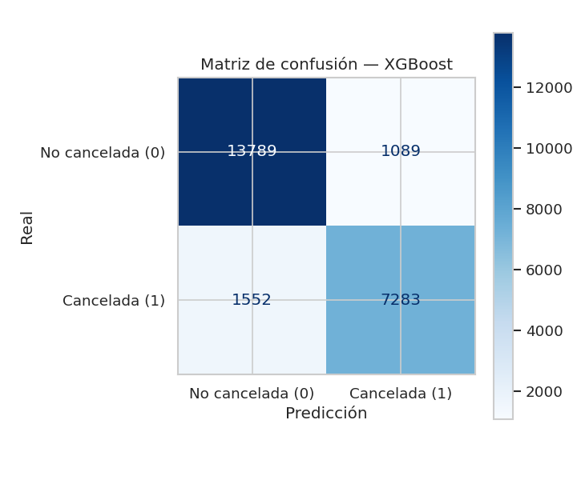
_Matriz de confusión del modelo ganador (XGBoost) sobre el conjunto de prueba: los aciertos están en la diagonal._

---

## 5. Reflexión crítica: limitaciones y mejoras

**Limitaciones actuales.**

- **Validación temporal pendiente:** la partición es aleatoria. Como las reservas tienen
  fecha (2015–2017), una división _por tiempo_ (entrenar con el pasado, probar con el
  futuro) sería más realista y probablemente daría una cifra algo más baja, pero más fiable.
- **Desbalance sin tratamiento explícito:** se aborda con estratificación y una métrica
  adecuada, no con técnicas de reequilibrado. El balanceo (`class_weight`, SMOTE) se exploró
  y sube el _recall_ a costa de precisión, pero deja el ROC-AUC casi igual, por lo que no se
  incorpora al _pipeline_ de producción.
- **Cardinalidad simplificada:** agrupar las categorías raras en `Otros` sacrifica parte de
  su información individual.
- **Umbral fijo en 0.5:** no se ha ajustado a un objetivo de negocio concreto.

**Líneas de mejora.**

- **Un modelo por hotel.** El EDA mostró que el _City Hotel_ y el _Resort Hotel_ se
  comportan casi como dos negocios distintos, con estacionalidad y tasa de cancelación
  diferentes. Entrenar un modelo especializado para cada uno, en lugar de uno único, podría
  capturar mejor sus patrones propios, a costa de mantener y servir dos modelos.
- **Validación temporal** para cifras más fiables que la partición aleatoria.
- **_Embeddings_** para las categóricas de alta cardinalidad (`country`, `agent`), que
  preservarían más señal que el agrupamiento.
- **Infraestructura con más memoria** (p. ej. Hugging Face Spaces) para reactivar la carga
  del modelo desde el _Model Registry_ de MLflow en el despliegue público, hoy limitado por
  la RAM del _tier_ gratuito.

---

## 6. Conclusiones

Este trabajo ha abordado la predicción de cancelaciones de reservas hoteleras como un
problema de clasificación binaria de principio a fin: desde un análisis exploratorio que
**detecta y corrige fugas de información** —el origen del optimismo de versiones previas—
hasta un sistema desplegado en producción. La decisión metodológica más relevante fue
_anteponer la honestidad al número_: eliminar las variables de _check-in_
(`required_car_parking_spaces`, `assigned_room_type`) rebaja el ROC-AUC de un 0.9614
engañoso a un **0.9529 realista**, una cifra que sí mide lo que el modelo podrá hacer ante
una reserva futura.

De las cinco familias comparadas en igualdad de condiciones, **XGBoost** resulta la
ganadora, combinando la mejor métrica de ordenación con un coste de entrenamiento mínimo. Un
componente relevante del _pipeline_ es el `RareCategoryGrouper`, un transformador propio —no
disponible en scikit-learn— que aplica una reducción supervisada de cardinalidad: ajustado
solo en entrenamiento, conserva las categorías con señal de cancelación extrema en `country`,
`agent` y `company` y agrupa el resto, reduciendo de 902 a 144 columnas sin pérdida de poder
predictivo. Junto con las variables derivadas de la ausencia informativa
(`has_company`/`has_agent`), preserva la mayor parte de la señal. La interpretabilidad con
SHAP confirma, además, que el modelo se apoya en factores con sentido de negocio (depósito no
reembolsable, país, antelación, cancelaciones previas), no en artefactos.

El resultado es un sistema reproducible y **accesible en línea** (API REST, interfaz web y
registro de experimentos), que no solo predice sino que _explica_ cada decisión. Entre las
líneas de mejora, la más respaldada por el análisis es **separar el sistema en dos modelos
especializados**, uno por tipo de hotel (_City_ y _Resort_): el EDA mostró que se comportan
como negocios distintos, con estacionalidad y tasa de cancelación propias, por lo que un
modelo por hotel capturaría mejor sus patrones. Otras vías —validación temporal o _embeddings_
para la alta cardinalidad— complementan ese camino más allá del alcance de esta memoria.

---

## Bibliografía

1. _Receiver operating characteristic_ (curva ROC, AUC y su equivalencia con el estadístico
   de Mann–Whitney). Wikipedia (consultado en junio de 2026).
   <https://en.wikipedia.org/wiki/Receiver_operating_characteristic>
2. T. Chen y C. Guestrin. _XGBoost: A Scalable Tree Boosting System_. Proceedings of the
   22nd ACM SIGKDD, 2016. <https://doi.org/10.1145/2939672.2939785>
3. S. M. Lundberg y S.-I. Lee. _A Unified Approach to Interpreting Model Predictions_.
   Advances in Neural Information Processing Systems (NeurIPS), 2017.
4. N. Antonio, A. de Almeida y L. Nunes. _Hotel booking demand datasets_. Data in Brief,
   vol. 22, 2019. <https://doi.org/10.1016/j.dib.2018.11.126>
