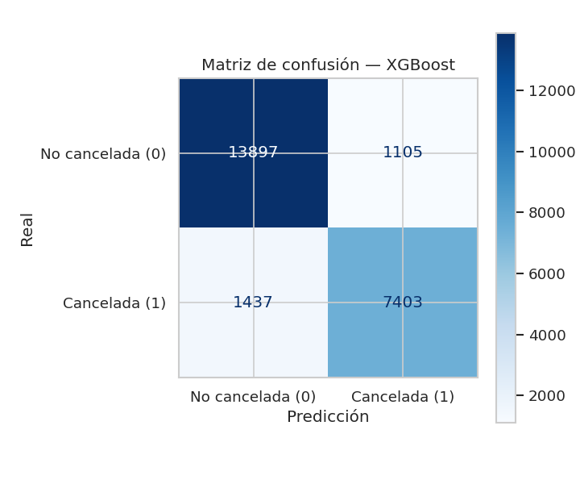

# 🏨 Predicción de cancelaciones de reservas hoteleras

> Sistema automático de **entrenamiento, evaluación y comparación** de modelos de
> clasificación binaria, desarrollado como entrega final del módulo de
> **Machine Learning y Deep Learning** (Máster en IA, Cloud Computing y DevOps).

El proyecto entrena cinco algoritmos distintos para predecir si una reserva de
hotel será **cancelada** (`is_canceled = 1`) o no (`is_canceled = 0`), los compara
con un conjunto común de métricas y selecciona automáticamente el mejor modelo.

---

## 👥 Autores

| Autor | Rol principal |
|-------|---------------|
| **Manuel Pérez** (manugijon@gmail.com) | Ingeniería del pipeline, modelado y documentación |
| **[Nombre compañero/a]** (*[email]*) | *[Pendiente de completar — ver `docs/informe_final.md`]* |

> ℹ️ La práctica es por parejas. El reparto detallado de roles está en
> [`docs/informe_final.md`](docs/informe_final.md). Sustituid el placeholder por
> los datos reales del/de la segundo/a integrante.

---

## 🎯 Descripción del problema y de los datos

**Problema.** Las cancelaciones son uno de los mayores quebraderos de cabeza del
sector hotelero: afectan a la planificación de ocupación, a la política de
*overbooking* y a los ingresos. Anticipar qué reservas tienen alto riesgo de
cancelación permite tomar decisiones proactivas (overbooking controlado,
incentivos de retención, exigencia de depósito).

**Datos.** Dataset real de reservas hoteleras (~119 000 registros de un *City
Hotel* y un *Resort Hotel* en Portugal, 2015–2017). La variable objetivo
`is_canceled` está **moderadamente desbalanceada** (~37 % de cancelaciones). El
fichero original incluye 31 variables predictoras: temporales (`lead_time`,
`arrival_date_*`), de la reserva (`deposit_type`, `market_segment`,
`customer_type`...), del cliente (`country`, `is_repeated_guest`...) y económicas
(`adr`).

Dos aspectos detectados en el EDA condicionan el diseño:

- **Fuga de información (*data leakage*):** `reservation_status` y
  `reservation_status_date` describen el desenlace de la reserva y filtran el
  target → **se eliminan siempre**.
- **Valores ausentes y alta cardinalidad:** `company` (~94 % nulos) se descarta;
  `agent`, `country` y `children` se tratan/imputan; las categóricas de alta
  cardinalidad se codifican con un tope de categorías.

El análisis completo está en [`notebooks/01_eda.ipynb`](notebooks/01_eda.ipynb).

---

## 🗂️ Estructura del proyecto

```
project/
├── data/
│   ├── raw/            # Dataset original (dataset_practica_final.csv)
│   └── processed/      # Datos intermedios (regenerables)
├── docs/
│   └── informe_final.md     # Informe final (roles, EDA, diseño, reflexión)
├── models/             # Modelos entrenados (.pkl, regenerables)
│   └── best_model.pkl  # Mejor modelo seleccionado para producción
├── notebooks/
│   ├── 01_eda.ipynb              # Análisis exploratorio de datos
│   └── 02_comparativa_modelos.ipynb  # Comparativa y visualizaciones
├── outputs/            # Gráficos y tabla de métricas generados por el pipeline
│   ├── roc_curves.png
│   ├── confusion_matrices.png
│   ├── confusion_matrix_best.png
│   ├── feature_importance.png
│   └── metricas_modelos.csv
├── src/                # Código fuente (paquete Python)
│   ├── config.py          # Configuración y constantes
│   ├── data_loader.py     # Carga, limpieza y partición de datos
│   ├── preprocessing.py   # ColumnTransformer (imputación + escala + one-hot)
│   ├── model_trainer.py   # Clase ModelTrainer + envoltorio Keras
│   ├── evaluator.py       # Métricas y visualizaciones
│   ├── train.py           # 🚀 Script principal del pipeline
│   └── predict.py         # Inferencia con el mejor modelo
├── requirements.txt
└── README.md
```

---

## ⚙️ Instalación y configuración del entorno virtual

Requisitos: **Python 3.12** (probado en 3.12.3).

```bash
# 1) Situarse en la carpeta del proyecto
cd project

# 2) Crear y activar el entorno virtual
python3 -m venv .venv
source .venv/bin/activate          # Linux / macOS
# .venv\Scripts\activate           # Windows (PowerShell)

# 3) Instalar las dependencias
pip install --upgrade pip
pip install -r requirements.txt
```

---

## ▶️ Ejecución

Todos los comandos se ejecutan desde la carpeta `project/` con el entorno activado.

### 1. Entrenar y comparar todos los modelos (pipeline completo)

```bash
python -m src.train
```

Este comando ejecuta el flujo de principio a fin: **carga → preprocesado →
entrenamiento de los 5 modelos → evaluación → selección del mejor**, y guarda:

- `models/*.pkl` (un modelo por algoritmo) y `models/best_model.pkl`.
- `outputs/metricas_modelos.csv` y `.md` (tabla comparativa).
- `outputs/roc_curves.png`, `confusion_matrices.png`,
  `confusion_matrix_best.png`, `feature_importance.png`.

### 2. Hacer inferencia con el mejor modelo

```bash
# Sobre una muestra del dataset original (demostración)
python -m src.predict --sample 10

# Sobre un CSV propio con reservas
python -m src.predict --input mis_reservas.csv --output predicciones.csv
```

### 3. Explorar los notebooks

```bash
# Registrar el kernel del entorno (una sola vez) y abrir Jupyter
python -m ipykernel install --user --name pontia-ml --display-name "Python (pontia-ml)"
jupyter lab    # o jupyter notebook
```

- `notebooks/01_eda.ipynb` — análisis exploratorio y decisiones de modelado.
- `notebooks/02_comparativa_modelos.ipynb` — consume los artefactos del pipeline
  y muestra la comparativa, las visualizaciones y la inferencia.

---

## 📊 Resultados

Métricas sobre el conjunto de **test** (20 %, partición estratificada,
`random_state=42`). Métrica principal de selección: **ROC-AUC**.

| Modelo | Accuracy | Precision | Recall | F1 | **ROC-AUC** |
|--------|:--------:|:---------:|:------:|:--:|:-----------:|
| **XGBoost** ⭐ | 0.8826 | 0.8575 | 0.8195 | 0.8380 | **0.9548** |
| Neural Network (Keras) | 0.8746 | 0.8502 | 0.8034 | 0.8262 | 0.9483 |
| Random Forest | 0.8611 | 0.8871 | 0.7165 | 0.7927 | 0.9431 |
| Decision Tree | 0.8542 | 0.8264 | 0.7680 | 0.7961 | 0.9337 |
| Logistic Regression | 0.8246 | 0.8045 | 0.6960 | 0.7464 | 0.9072 |

⭐ **Mejor modelo: XGBoost** (ROC-AUC = 0.955), persistido como
`models/best_model.pkl`.

<p align="center">
  
  
</p>
<p align="center">
  
</p>

### ¿Por qué ROC-AUC como métrica principal?

1. **Robusta al desbalance** de clases (~37 % de positivos): a diferencia del
   *accuracy*, no se ve inflada por la clase mayoritaria.
2. **Independiente del umbral** de decisión: mide la capacidad de *ranking* del
   modelo, lo que da flexibilidad para ajustar el umbral según la política de
   *overbooking* del hotel.
3. **Comparable** entre algoritmos de naturaleza muy distinta.

Como métricas secundarias de negocio se reportan **recall** (proporción de
cancelaciones detectadas) y **F1** (equilibrio precisión/recall).

---

## ✅ Conclusiones

- Los modelos de **gradient boosting (XGBoost)** y la **red neuronal** lideran la
  comparativa, confirmando su idoneidad para datos tabulares con interacciones
  no lineales. XGBoost gana además en eficiencia de entrenamiento.
- Las variables más predictivas (`deposit_type=Non Refund`, `lead_time`, `adr`,
  `country`, `total_of_special_requests`) coinciden con la intuición de negocio
  observada en el EDA.
- El sistema queda **productivizado**: un único comando entrena, evalúa,
  selecciona y persiste el mejor modelo, y otro permite hacer inferencia.

La discusión detallada, las limitaciones y las líneas de mejora están en
[`docs/informe_final.md`](docs/informe_final.md).

---

## 🧰 Stack tecnológico

Python 3.12 · scikit-learn · XGBoost · TensorFlow/Keras · pandas · NumPy ·
matplotlib · seaborn · plotly · Jupyter. Versiones exactas en
[`requirements.txt`](requirements.txt).
