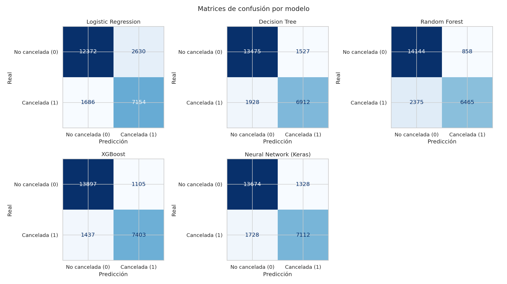
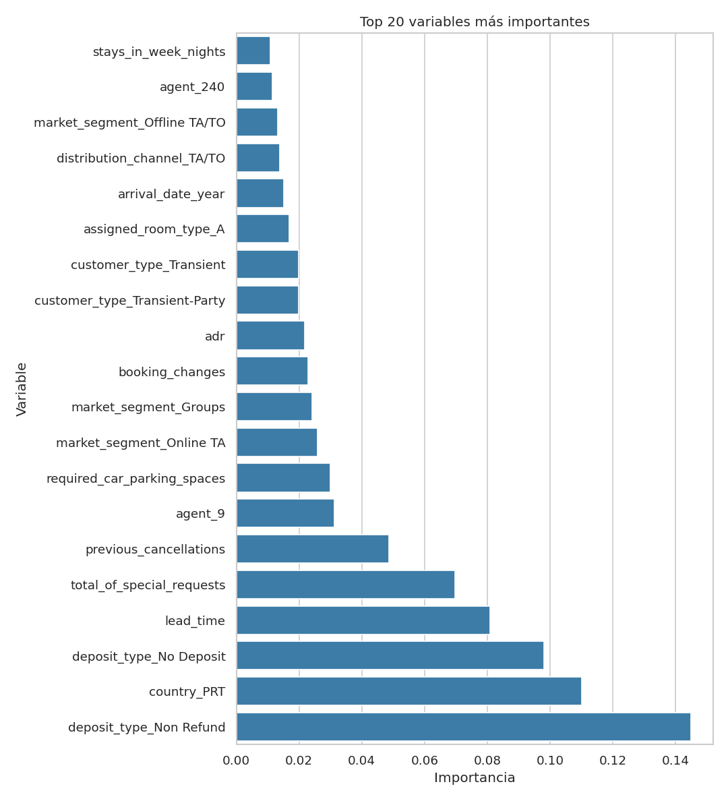

# Informe final — Predicción de cancelaciones de reservas hoteleras

**Máster en IA, Cloud Computing y DevOps · Módulo de Machine Learning y Deep Learning**

---

## 1. Roles de la pareja

La práctica se ha realizado por parejas. El reparto de responsabilidades ha sido
el siguiente (rellenar/ajustar con los datos reales del/de la segundo/a integrante):

| Integrante | Responsabilidades principales | Aportaciones concretas |
|------------|-------------------------------|------------------------|
| **Manuel Pérez** (manugijon@gmail.com) | Arquitectura del sistema, modelado y documentación | Diseño del paquete `src/`, pipeline de entrenamiento (`train.py`), envoltorio Keras, evaluador y redacción de README/informe |
| **[Nombre compañero/a]** (*[email]*) | *[p. ej.: EDA, preprocesado y validación]* | *[p. ej.: notebook de EDA, diseño del `ColumnTransformer`, pruebas de hiperparámetros, revisión de resultados]* |

> La contribución individual es trazable a través del **historial de commits** del
> repositorio. En caso de no distinguirse roles, ambos integrantes reciben la
> misma calificación (según el enunciado).

---

## 2. Justificación del problema

Las **cancelaciones de reservas** son un problema económico de primer orden en el
sector hotelero. Una cancelación tardía deja una habitación vacía que difícilmente
se vuelve a vender, distorsiona la previsión de ocupación y complica la gestión de
personal y recursos. La práctica habitual del sector para mitigarlo —el
*overbooking*— solo es segura si se puede **estimar el riesgo de cancelación** de
cada reserva.

Por tanto, predecir `is_canceled` es un caso de uso **realista y de alto valor**:

- **Aplicación directa:** priorización de reservas para *overbooking*, campañas de
  retención, exigencia de depósito a reservas de alto riesgo.
- **Variable objetivo binaria y bien definida** (0/1), ideal para clasificación.
- **Dataset rico** (~119 000 registros, 31 variables de naturaleza heterogénea:
  temporales, categóricas, numéricas), que permite ilustrar un preprocesado
  completo y comparar algoritmos de familias distintas.

---

## 3. Análisis exploratorio de datos (EDA)

El EDA completo y reproducible está en
[`notebooks/01_eda.ipynb`](../notebooks/01_eda.ipynb). Principales hallazgos y su
traducción a decisiones de diseño:

### 3.1. Variable objetivo

- **~37 % de las reservas se cancelan** (75 166 no canceladas vs. 44 224
  canceladas). Desbalance **moderado**.
- *Decisión:* partición **estratificada** y métrica principal **ROC-AUC** (no
  *accuracy*).

### 3.2. Fuga de información (*data leakage*)

- `reservation_status` toma el valor `Canceled`/`No-Show` **exactamente** cuando
  `is_canceled = 1`. Junto con `reservation_status_date`, son **posteriores** a la
  decisión de cancelar.
- *Decisión:* eliminar ambas columnas siempre (`config.LEAKAGE_COLUMNS`). De no
  hacerlo, cualquier modelo alcanzaría ~100 % de acierto de forma **engañosa**.

### 3.3. Valores ausentes

| Columna | % nulos | Tratamiento |
|---------|:-------:|-------------|
| `company` | ~94 % | **Eliminar** (no aporta señal utilizable) |
| `agent` | ~14 % | Categórica; nulos → `"Unknown"` |
| `country` | ~0.4 % | Imputar (constante `"Unknown"`) |
| `children` | residual | Imputar (mediana) |

### 3.4. Variables numéricas

- `lead_time` (antelación de la reserva) es la numérica que **más correlaciona**
  con la cancelación: a mayor antelación, mayor probabilidad de cancelar.
- `total_of_special_requests` y `required_car_parking_spaces` correlacionan
  **negativamente** (clientes más comprometidos cancelan menos).
- Escalas muy dispares → **estandarización** (`StandardScaler`).

### 3.5. Variables categóricas

- `deposit_type = "Non Refund"` tiene una tasa de cancelación **cercana al 99 %**:
  variable extremadamente predictiva.
- El *City Hotel* cancela más que el *Resort Hotel*.
- Segmentos `Groups` y `Offline TA/TO` cancelan más que `Direct`/`Corporate`.
- `country` y `agent` son de **alta cardinalidad** (178 y 334 valores) → one-hot
  con tope de categorías (`max_categories`) para controlar la dimensionalidad.

### 3.6. Limpieza adicional

- Se eliminan ~180 reservas **sin ningún huésped** (`adults+children+babies = 0`),
  registros claramente inconsistentes.

---

## 4. Diseño del sistema

El proyecto está estructurado como un **paquete de software modular** (`src/`),
separando responsabilidades en lugar de concentrar todo en un notebook.

### 4.1. Flujo de datos (pipeline)

```
 raw CSV ──► data_loader ──► preprocessing ──► model_trainer ──► evaluator ──► best_model.pkl
            (carga +        (ColumnTransformer  (5 modelos en     (métricas +
             limpieza +      imputación+escala   Pipelines)        ROC + CM +
             split          + one-hot)                             importancia)
             estratificado)
```

### 4.2. Módulos

| Módulo | Responsabilidad |
|--------|-----------------|
| `config.py` | Rutas, semillas, columnas, hiperparámetros y métrica principal (punto único de configuración). |
| `data_loader.py` | Carga del CSV, normalización de nulos, eliminación de *leakage*/`company`, limpieza y partición estratificada. |
| `preprocessing.py` | `ColumnTransformer`: numéricas (imputación mediana + `StandardScaler`) y categóricas (imputación constante + `OneHotEncoder` con tope de categorías). |
| `model_trainer.py` | Clase `ModelTrainer` que envuelve cada modelo en un `Pipeline(preprocesador + modelo)` y los entrena; envoltorio `KerasMLPClassifier` compatible con scikit-learn. |
| `evaluator.py` | Clase `Evaluator`: métricas, tabla comparativa, selección del mejor, curva ROC, matrices de confusión e importancia de variables. |
| `train.py` | **Script principal** que orquesta el flujo completo y persiste los artefactos. |
| `predict.py` | Inferencia con `best_model.pkl` (entrada cruda → predicción). |

### 4.3. Decisiones de ingeniería destacables

- **Uso de `Pipeline` de scikit-learn**: el preprocesado se ajusta **solo con los
  datos de entrenamiento** dentro de cada `Pipeline`, evitando *data leakage* entre
  train y test, y permitiendo persistir preprocesado + modelo como una sola unidad.
- **Comparación justa**: los cinco modelos comparten exactamente el mismo
  preprocesador.
- **Red neuronal integrable**: `KerasMLPClassifier` implementa la interfaz
  `fit/predict/predict_proba` y es **serializable** (guarda/recupera el modelo
  Keras en formato `.keras`), de modo que puede ser el `best_model.pkl` sin
  problemas.
- **Reproducibilidad**: `random_state=42` en particiones y modelos; semilla fijada
  también en TensorFlow.

### 4.4. Modelos entrenados

1. **Regresión logística** — línea base lineal.
2. **Árbol de decisión** — modelo interpretable, no lineal.
3. **Random Forest** — *ensemble* de árboles (bagging).
4. **XGBoost** — gradient boosting.
5. **Red neuronal multicapa (Keras/TensorFlow)** — MLP con capas densas
   `64-32-16`, *dropout* 0.3, activación ReLU, salida sigmoide, optimizador Adam y
   **early stopping** sobre `val_loss`.

---

## 5. Resultados y elección final

Evaluación sobre el **test** (23 842 reservas, 20 % estratificado).

| Modelo | Accuracy | Precision | Recall | F1 | **ROC-AUC** |
|--------|:--------:|:---------:|:------:|:--:|:-----------:|
| **XGBoost** ⭐ | 0.8826 | 0.8575 | 0.8195 | 0.8380 | **0.9548** |
| Neural Network (Keras) | 0.8746 | 0.8502 | 0.8034 | 0.8262 | 0.9483 |
| Random Forest | 0.8611 | 0.8871 | 0.7165 | 0.7927 | 0.9431 |
| Decision Tree | 0.8542 | 0.8264 | 0.7680 | 0.7961 | 0.9337 |
| Logistic Regression | 0.8246 | 0.8045 | 0.6960 | 0.7464 | 0.9072 |






### 5.1. Elección del modelo y de la métrica

- **Métrica principal: ROC-AUC.** Robusta al desbalance, independiente del umbral
  (lo que permite ajustar la agresividad del *overbooking*) y comparable entre
  algoritmos. Se reportan además recall y F1 por su lectura de negocio.
- **Modelo elegido: XGBoost** (ROC-AUC = 0.955). Supera al resto en la métrica
  principal y en F1, con un coste de entrenamiento muy bajo (~1.3 s). Se persiste
  como `models/best_model.pkl`.

### 5.2. Lectura de negocio

- XGBoost detecta el **82 % de las cancelaciones reales** (recall 0.82) con una
  precisión del 86 %: un buen equilibrio para accionar políticas de retención sin
  generar demasiados falsos positivos.
- El Random Forest es el más **conservador** (mayor precisión, menor recall):
  preferible si el coste de un falso positivo fuese muy alto.

---

## 6. Reflexión crítica: limitaciones y mejoras

**Limitaciones actuales**

- **Hiperparámetros fijos:** se han usado valores razonables pero no optimizados
  sistemáticamente.
- **Desbalance sin tratamiento explícito:** se aborda con estratificación y métrica
  adecuada, pero no con técnicas de *resampling* ni `class_weight`.
- **Validación simple train/test:** no se ha empleado validación cruzada para
  estimar la varianza de las métricas.
- **Alta cardinalidad simplificada:** `country`/`agent` se recortan con
  `max_categories`, lo que descarta parte de la información de las categorías raras.
- **Umbral fijo en 0.5:** no se ha calibrado el umbral de decisión a un objetivo de
  negocio concreto.

**Líneas de mejora (trabajo futuro)**

- **Optimización de hiperparámetros** con `GridSearchCV`/`RandomizedSearchCV` o
  *bayesian optimization*.
- **Balanceo de clases**: `class_weight='balanced'`, SMOTE o *undersampling*.
- **Validación cruzada estratificada** (k-fold) para métricas más fiables.
- **Interpretabilidad avanzada** con SHAP, más allá de `feature_importances_`.
- **Codificación de alta cardinalidad** con *target/embedding encoding*.
- **Calibración de probabilidades** y ajuste del umbral por coste/beneficio.
- **Productivización**: exponer el modelo vía API (FastAPI) y registrar
  experimentos con MLflow.

---

> **Reproducibilidad.** Todos los resultados de este informe se generan ejecutando
> `python -m src.train` desde `project/` con las dependencias de `requirements.txt`
> (Python 3.12). Las tablas y figuras provienen de `outputs/`.
